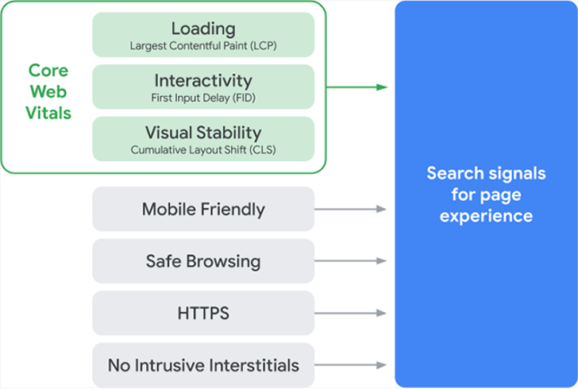
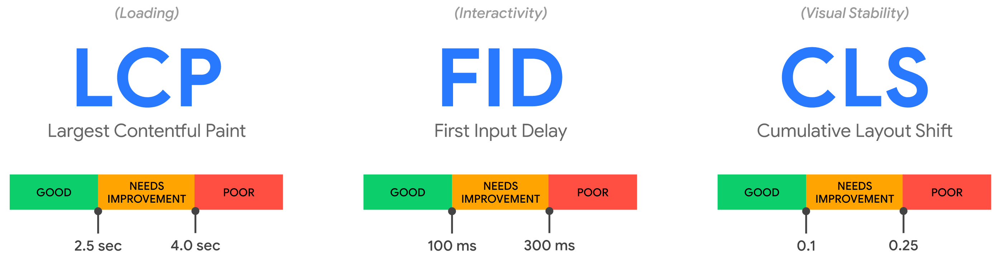

Google está introduciendo nuevas señales que afectan al posicionamiento de las webs, combinando Core Web Vitals con señales de experiencia de usuario existentes, para mejorar la evaluacón de la experiencia general proporcionada por una web.

Estas nuevas señales de clasificación se empezó a desarrollar a principios de 2020 y [empezarán a utilizarse en mayo de 2021](https://developers.google.com/search/blog/2020/11/timing-for-page-experience).

## La nueva señal de "experiencia de página"

La próxima señal de clasificación se conocerá como la señal de _experiencia de la página_.

La señal de experiencia de la página consta de [Core Web Vitals](https://web.dev/vitals/), así como estas métricas de experiencia de página existentes:

- Compatibilidad con dispositivos móviles
- Navegación segura
- Seguridad HTTPS
- Guías sobre elementos intersticiales intrusivos

La señal de experiencia de la página mide cómo los usuarios perciben la experiencia de interactuar con una página web. La optimización de estos factores hace que la web sea más agradable para los usuarios con independencia del navegador, y ayuda a que los sitios evolucionen hacia las expectativas de los usuarios en dispositivos móviles.

## Core Web Vitals

Core Web Vitals, introducidas en mayo de 2020, son un conjunto de métricas relacionadas con la velocidad, la capacidad de respuesta y la estabilidad visual.

Google ha definido estas métricas dentro de Core Web Vitals:

- **Largest Contentful Paint** (área de pintado con contenido más grande): el tiempo que tarda en cargarse el contenido principal de una página. Un vaor de LCP ideal es de 2,5 segundos o más rápido.
- **First Input Delay** (retraso de la primera interacción): el tiempo que tarda una página en volverse interactiva. Una medida ideal es menos de 100 ms.
- **Cumulative Layout Shift** (desplazamiento de diseño acumulado): la cantidad de cambios inesperados de posición y tamaño de elementos del contenido de la página. Una medida ideal es menos de 0,1.

Las Core Web Vitals pueden variar en el futuro, tanto el conjunto de métricas como su escalla de valores.

Estas métricas son la evolución de otras, como el tiempo de carga, que no se correlacionaban necesariamente con una buena o mala experiencia.

## La señal de página de experiencia y el ranking

Al añadir Core Web Vitals como factores de ranking y combinarlos con otras señales de experiencia del usuario, Google tiene como objetivo ayudar a más propietarios de sitios a crear páginas que los usuarios disfruten.

Si Google determina que una página ofrece una experiencia de usuario de alta calidad, en función de su señal de experiencia de página, es probable que clasifique la página en un lugar más alto en los resultados de búsqueda.

Sin embargo, la relevancia del contenido sigue siendo considerablemente importante cuando se trata del ranking. Una página con contenido que es muy relevante para una consulta posiblemente podría clasificarse bien incluso si tuviera una mala señal de experiencia en la página.

Lo contrario también es cierto, como afirma Google:

> “Una buena experiencia en la página no anula tener contenido excelente y relevante. Sin embargo, en los casos en que hay varias páginas con contenido similar, la experiencia de la página se vuelve mucho más importante para la visibilidad en la búsqueda".

Como menciona Google, una señal de experiencia en la página es una especie de desempate. Lo que significa que si hay dos páginas que ofrecen contenido excelente, la que tenga la señal de experiencia de página más sólida tendrá una clasificación más alta en los resultados de búsqueda.

## Qué hacer en mi web

¿Debes preocuparte por estas métricas? Sí y no. Piensa en ellas como una forma de evaluar tu web para encontrar problemas y priorizar las soluciones. No tanto porque vaya a afectar a tu ranking en Google sino porque afecta al usuario final.

Un gran contenido puede, en teoría, superar a una gran experiencia de página. Si tu web carga rápido y tiene un buen contenido los usuarios la usarán (y compartirán) más a menudo. Web Vitals es una señal más que Google usará para el ranking, pero un buen rendimiento web ayudará a otras señales de forma indirecta.

## Evaluando la experience de página

### Cómo medir las Core Web Vitals

Cuando se trata de medir Core Web Vitals se pueden utilizar estas herramientas:

- Search Console
- PageSpeed Insights
- Lighthouse
- Chrome DevTools
- Chrome UX report

### Cómo medir otras señales de la experiencia del usuario

Éstas son las otras señalles y cómo puedes medirllas:

- Compatibilidad con dispositivos móviles: utiliza la prueba de optimización para dispositivos móviles de Google.
- Navegación segura: consulta el informe de "Problemas de seguridad" en Search Console para ver si hay algún problema con la navegación segura.
- HTTPS: si una página se sirve a través de una conexión HTTPS segura, se mostrará un icono de candado en la barra de direcciones del navegador.
- Directrices de intersticiales intrusivos: reduce las ventanas modales que aparecen en cuanto tu página carga.

## Core Web Vitals y Perf.reviews

Desde Perf.reviews seguimos haciendo análisis de webs y ofrecemos [servicios de auditoría para empresas, con un especial foco en Web Vitals](/servicios/).

Si crees que es momento de revisar tu web, contáctanos.
