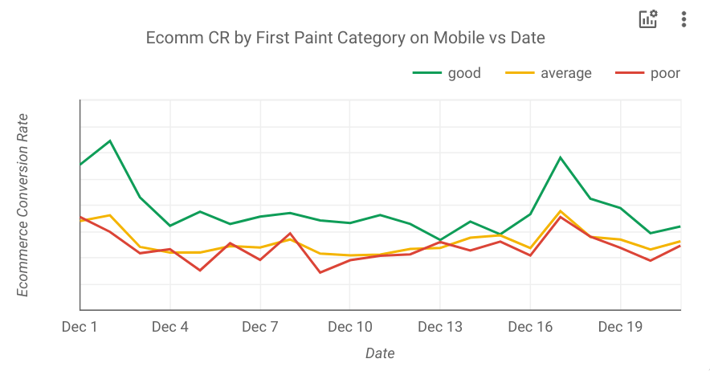
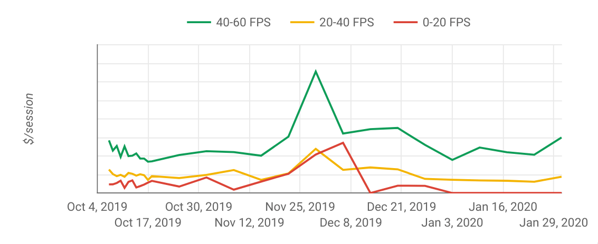
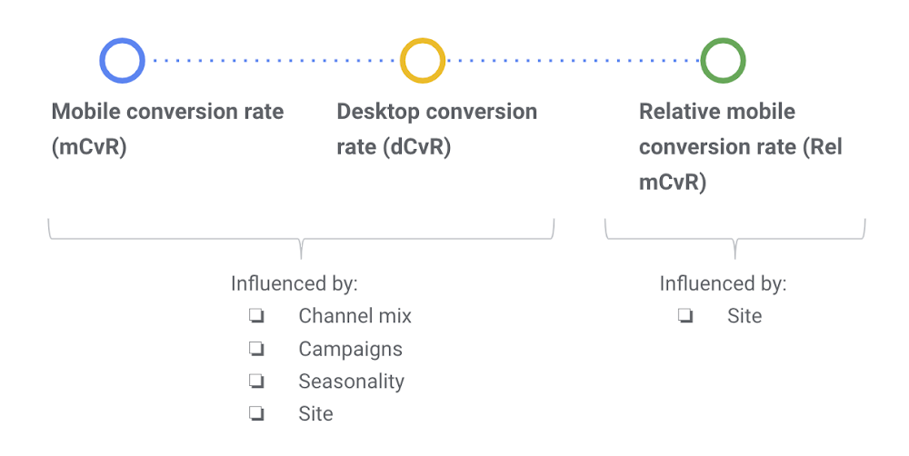
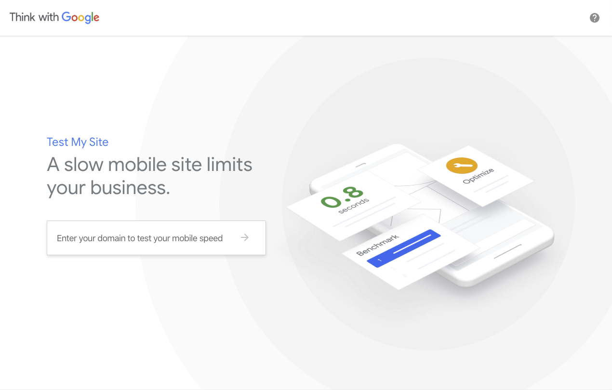
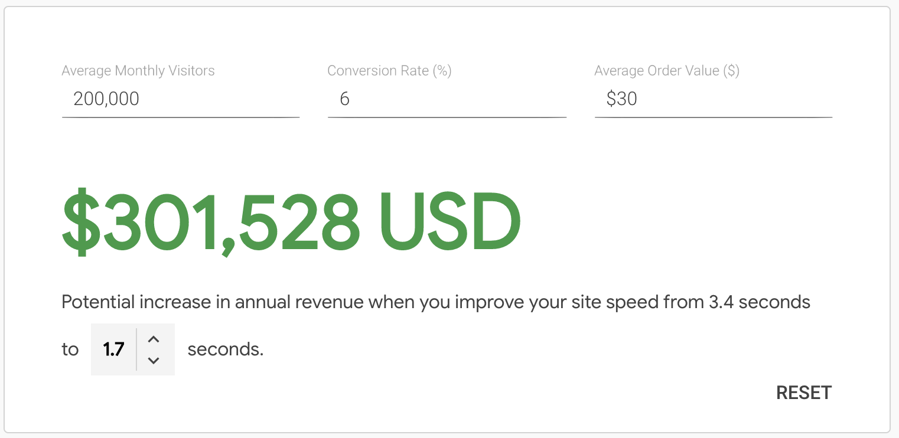

<small><i>This post was first published on <a href="https://jmperezperez.com/assess-performance-impact/">José M. Pérez's blog</a>.</i></small>

Web Performance is important for user experience and business metrics. Estimating its impact is key to be able to prioritize it, yet it's difficult to quantify its benefits until the work has been done.

We need to break this chicken-and-egg loop. This post explains several ways of assessing the potential performance gains with little effort and, more importantly, without actually implementing fixes.

## What is the business opportunity for web performance improvements?

In the past I have been too naive thinking that every stakeholder would care as much as I do about web performance. *"Look, there are many case studies proving a correlation between loading time and business metrics!"* - I would repeat over and over. Previous results from other companies or websites, like [those published on WPO Stats](https://wpostats.com/), are essential to start a conversation about the topic, but it's not sufficient. **How will that apply to my business?**

I thought that the best way to prove the value would be to [audit performance using Lighthouse](https://web.dev/measure), fix the issue with lowest effort/highest impact, and measure. This can work if the audit shows potential improvements and the stakeholders agree to dedicate time and people to run the initial experiment.

However, more often than not **performance audits are not enough to move the needle**. Yes, you can get an estimation of potential time savings, but can't be translated directly into conversions or revenue, which are the metrics that the business cares about.

During last months I have come across these low effort techniques to size the opportunity for web performance improvements linking performance metrics to business metrics:

1. **Plotting Business Metrics vs Performance Metrics**: How to track both performance metrics and business metrics and establish correlations between them.

2. **Measuring the Relative Mobile Conversion Rate**: Identify performance issues by comparing the conversion rates on mobile and desktop.

3. **Using Test My Site from Think with Google**: Gives you an estimation of potential revenue increase for your site when saving loading time.

## 1. Plotting Business Metrics vs Performance Metrics

Think about what you are trying to drive on your existing site. Is it newsletter registrations? Leads? Purchases? When a user performs those actions, the user has converted. It's important to track these conversion events, and you can do it in your own system or leveraging tools like Google Analytics or Facebook Analytics.

Now the question is: **how does user experience affect conversion rate?** Assuming there are enough conversions, it is possible to cluster these conversions based on a performance metric. This is exactly what [CP Clermont](https://twitter.com/cpclermont) did at ALDO and [described in his post "The Impact of Web Performance"](https://simplified.dev/performance/impact-of-web-performance).

The idea is that **if we can prove that users having a better web performance are converting more often, we can measure the impact of improving user's experience in money terms**. The best thing is that the effort is relatively low:

1. Track the conversion event, which you might be doing already
2. Add an event with a performance metric category. CP Clermont chose First Paint, Time to Interactive, Time to App Load (a custom metric for ALDO's SPA), and Frames per Second. Then, he translated the metrics into 3 categories (good, average, and poor) and logged a custom dimension on Google Analytics.
3. Plot business metrics vs performance metrics over time. For business metrics CP Clermont chose Conversion Rate and Revenue.

One could wonder if users having a better performance and spending more because they are using better devices (ie the latest iPhone), which have better CPUs and their users have likely a higher purchase power.

Using Google Analytics you can see what type of device the user is using and plot results by specific models to get an answer.

## 2.Measuring the Relative Mobile Conversion Rate

Another easy way to spot performance issues and making a business case is to look at conversation rates. This is [what Google calls Relative Mobile Conversion Rate (Rel mCvR)](https://www.blog.google/products/marketingplatform/analytics/mobile-challenge-and-how-measure-it/), which is calculated by dividing the mobile conversion rate with the desktop conversion rate.

Take this example:

<table style="margin:0 auto 1rem">
    <tr>
        <td></td>
        <th scope="col" style="font-weight:bold;text-align:right;padding:0.5em 1em">Mobile</th>
        <th scope="col" style="font-weight:bold;text-align:right;padding:0.5em 1em">Desktop</th>
    </tr>
    <tr>
        <th style="font-weight:bold;text-align:left;padding:0.5em 1em" scope="row">Conversion rate</th>
        <td style="text-align:right;padding:0.5em 1em">1.79%</td>
        <td style="text-align:right;padding:0.5em 1em">4.44%</td>
    </tr>
    <tr>
        <th style="font-weight:bold;text-align:left;padding:0.5em 1em" scope="row">Rel mCvR</th>
        <td style="font-weight:bold;text-align:right;padding:0.5em 1em" colspan="2">1.79% / 4.44% = 40%</td>
    </tr>
</table>

In this case the Rel mCvR is 40%.

Google says that **a good target for Rel mCvR is 70%**, meaning that mobile conversion rates are 30% lower than desktop. The reason why Rel mCvR can be a good metric is that it is not influenced by changes in traffic (eg seasonality or promotional campaigns). The following diagram explains it in more detail ([source](https://www.blog.google/products/marketingplatform/analytics/mobile-challenge-and-how-measure-it/)):

Note that Rel mCvR is influenced by UX too, since a bad UX on mobile will hurt mobile conversion rates. **You should use [Lighthouse](https://web.dev/measure) or [WebPageTest](https://www.webpagetest.org/) to ensure that there are performance issues and speed is the main contributor in Rel mCvR, and not usability.**

The key question is: _what's the target Rel mCvR?_ If we knew it we could assess the revenue that an increase in conversion rates would represent. For this we can use a similar approach to the first technique we described, clustering conversion rates based on performance metrics and calculating how many user could be "upgraded" to the following cluster (eg from slow to average experience and from average to fast).

**Rel mCvR can also be used to calculate the incremental revenue achieved after making a performance fix**. Measure what was the average Rel mCvR before and after the fix, and calculate what the revenue would have been if Rel mCvR hadn't changed.
On [their post "Value of Speed"](https://web.dev/value-of-speed/) you can find more information about the methodology and framework to measure the revenue impact.

## 3. Using Test My Site from Think with Google

Google has [a handy microsite called Test My Site](https://www.thinkwithgoogle.com/feature/testmysite/) that gives you a snapshot about your site and calculates the potential increase in revenue when improving your site speed. I would describe as a "Lighthouse report for business people".

To calculate the potential increase in revenue you only need to provide your average monthly visitors, conversion rate, and average order value.

Behind the scenes it is powered by data from the Chrome User Experience report database or HTTP Archive, which contains performance metrics gathered from real users that have visited your site (if you are interested in this data I recommend checking [CRUX.RUN](https://crux.run/)). It also uses Lighthouse to calculate the potential savings in loading time.

## Conclusion

Always complement your performance audits with assessment of expected revenue to understand the expected impact of the changes.
