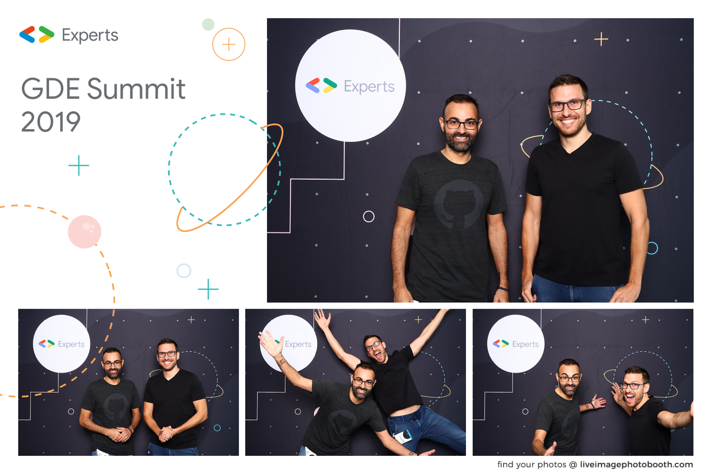

A finales de octubre tuvimos la oportunidad de asistir al evento anual que Google organiza para los *Developer Experts* en Sunnyvale, California. Después del evento conocimos a parte del equipo de [Cloudinary](https://cloudinary.com/), cuyas herramientas y servicios hemos utilizado a menudo para realizar revisiones de rendimiento. Fue también la primera vez que nos reunimos en persona desde que empezamos el proyecto PerfReviews (Joan está en Barcelona y Jose en Estocolmo).

## Google Developer Experts Summit 2019

Fue nuestra primera vez asistiendo a este evento en el que aprendimos más sobre PWA, Chrome Extensions, Google Chrome y Machine Learning.

Pero sobre todo conocimos a muchos otros compañeros del mundo web y compartimos experiencias. Nos dio la sensación de que la Web sigue muy viva y de que hay una comunidad muy grande de desarrolladores que son esenciales para hacer extender las mejores prácticas.

## Visita a Cloudinary

Cloudinary es un servicio que resulta de gran ayuda para servir imágenes y vídeos de forma óptima. Con ellos hablamos de su programa de [Media Developer Experts](https://cloudinary.com/partners/media-developers) y del gran trabajo que están haciendo para generar vídeos dinámicamente con distintos formatos, calidades y _aspect ratios_ con auto-cropping (más info [en su blog](https://cloudinary.com/blog)).

Siempre es interesante conocer la gente que trabaja creando estas herramientas y vivir de primera mano la cultura que se respira en su oficina. ¡Gracias por recibirnos!
