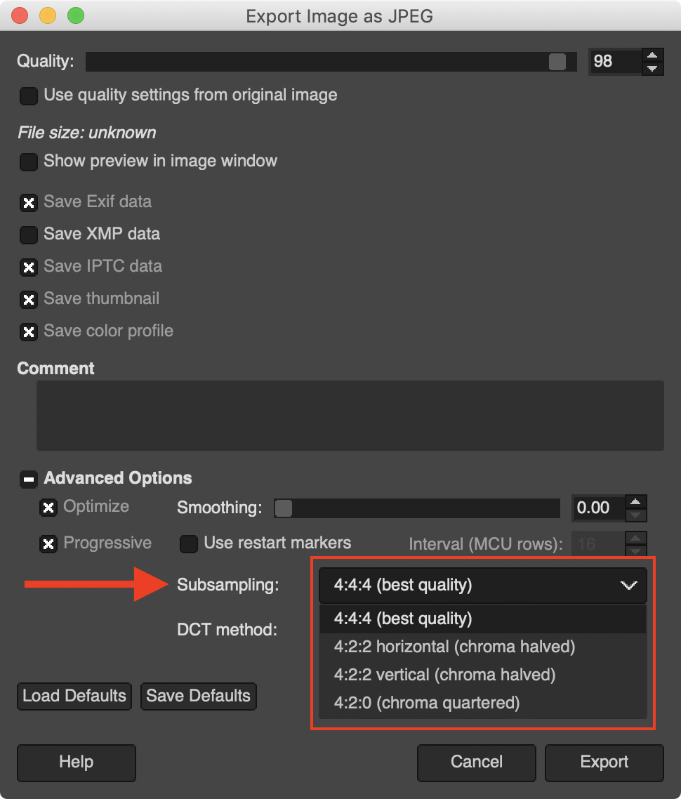

> Como profesionales del desarrollo web, nos preocupamos de escoger el mejor framework, la librería más actual, aplicar buenas prácticas en Javascript y CSS, ser cuidadosos de la semántica en el HTML para mejorar el SEO, estamos mejorando la accesibilidad de nuestro contenido, empaquetamos y dividimos los archivos para optimizar la carga, pero ¿qué pasa con las imágenes?

## Las imágenes en la web

Las imágenes son una parte muy importante de la web. Seguro que con el constante avance de la tecnología, donde vemos una mejora continua en la conectividad, posiblemente en un futuro los contenidos tendrán más vídeos que imágenes. Pero la base seguirá siendo la misma, mejorar la experiencia de usuarias y usuarios, que es de lo que va realmente nuestro trabajo.

De acuerdo con el [HTTP Archive](http://httparchive.org/), el 50% de los datos transferidos para buscar una página web son imágenes (JPEG, PNG y GIF). En agosto de 2019, en móvil las imágenes representaban 911KB del contenido cargado para el sitio promedio de 1.8MB, y en desktop son 1MB imágenes en un promedio de 2MB.

## La ~~optimización de imágenes~~ Image eXperience es cosa de todos

Hace unos días, en el artículo [Performance Web en tiempos modernos](https://octuweb.com/performance-web-en-tiempos-modernos/), Miguel Ángel nos hablaba de una situación donde tenía problemas para planificar una actividad para el fin de semana: _"Donde tendría que ver los horarios, aparece blanco sobre blanco. Creo que está cargando, tampoco estoy seguro... el tren ha llegado y mi móvil se va al bolsillo. "Luego pruebo con la web del otro cine"..."_.

Es muy probable que el texto de color blanco de los horarios esté sobre una fantástica e increíble imagen de una escena clave del último estreno cinematográfico, perfectamente contrastada, perfectamente encuadrada para llamar la atención del espectador e informar de los horarios para poder ver esa gran película... pero **no** se ha cargado la imagen.

Es ahí donde me permito utilizar el término IX (Image eXperience), hay varios puntos a tener en cuenta para una buena IX, y no sólo pasar las imágenes por el compresor que promete optimizar nuestras imágenes de la forma más efectiva.

En el desarrollo de una web hay varios perfiles, ya sea en equipos, personas o alguien que ejerce más de uno de esos roles: producto, UX, diseño, desarrollo, QA, hasta [DevOps](https://es.wikipedia.org/wiki/DevOps) (o lo que se conoce ahora como [SRE](https://landing.google.com/sre/)) en el proceso del pase a producción. Cada uno de esos roles tiene la responsabilidad de ofrecer lo mejor para el **usuario** o la **usuaria**, aportar el máximo valor al producto, fijarse en los detalles.

Sigamos con el ejemplo de la página de horarios de cine que Miguel Ángel no ha podido ver. Ante esa situación, estas son las preguntas que yo me hago y que se podrían haber utilizado con una checklist en el proceso de ideación, diseño, desarrollo y despliegue de esa página:

- ¿Realmente es necesaria una imagen para ofrecer esa información?
- Si se ha tenido en cuenta un texto blanco, para mantener un alto contraste con la imagen de fondo, ¿por qué no se ha definido un color de fondo en caso de que la imagen no se visualice?
- ¿Esa imagen está optimizada para dispositivos móviles?
- Si es una imagen en formato JPEG, ¿por qué no es un JPEG progresivo? eso hubiera mejorado la IX.
- Si es una imagen crítica para resaltar el producto _(en este caso tiene todo el sentido)_, ¿por qué no se ha tenido en cuenta la precarga de esa imagen?
- ¿No se ha definido un [budget](https://addyosmani.com/blog/performance-budgets/) para las imágenes?
- ¿No se han hecho tests en diferentes velocidades de conexión?

Como podéis ver, la optimización de imágenes para la web no es sólo elegir a qué porcentaje de compresión se guarda la imagen. Hay muchas cosas a tener en cuenta y muchos perfiles que pueden intervenir y detectar un posible fallo en una parte del producto tan crítica como la del ejemplo.

> Tratar en profundidad todos estos puntos dan para un libro... eps!, que al igual ya estoy en ello 🤪

## ~~Optimize~~ Adventure Time

En el escenario que nos encontramos ya hemos hecho el análisis previo de la necesidad de las imágenes, como el título del artículo indica, la pregunta más habitual es **¿Por dónde empiezo para optimizar mis imágenes?**.

## Optimización desde editores gráficos

En la primera línea de acción en la optimización de imágenes tenemos los editores de imágenes, como [Photoshop](https://www.adobe.com/Photoshop). [Affinity Photo](https://affinity.serif.com/en-gb/photo/), [Pixelmator](https://www.pixelmator.com/pro/), [PaintShopPro](https://www.paintshoppro.com/), [Paint.net](https://www.getpaint.net/) o [GIMP](https://www.gimp.org/) entre otros. No olvidemos a [Sketch](https://www.sketch.com/) que aún no siendo un programa para la edición de imágenes, se utiliza mucho en la edición de interfaces(1).

### Photoshop

Es el editor de imágenes más utilizado por los equipos de diseño. Curiosamente **no** es el que nos ofrece más opciones de optimización. En su última versión CC 2019 ofrece una ventana de diálogo de exportación con algunas mejoras para generar imágenes de varias densidades, como se puede ver en la columna de la izquierda, pero no nos deja mucha elección en cuanto al formato de imagen y parámetros de configuración.

Podemos exportar a los formatos PNG, JPG, GIF y SVG _(sí, SVG, genera un archivo SVG con la imagen incrustada en base64)_, más allá del porcentaje(2) de calidad no tenemos muchos parámetros de configuración para exportar las imágenes. Lo que llama mucho la atención es que no podemos contar con el formato WebP para la exportación.

En versiones anteriores de Photoshop, y en esta como bajo el nombre de "Save the Web... (legacy)", nos ofrece algunas configuraciones predefinidas, siempre según el criterio del equipo de Adobe. Uno de los parámetros que echo de menos en Photoshop es el del [Submuestreo de crominancia](https://es.wikipedia.org/wiki/Submuestreo_de_crominancia)(3) donde podríamos optimizar mejor la optimización según nuestro criterio. En su lugar mantienen un submuestreo de 4:4:4 (1x1) entre los valores 51% a 100% del porcentaje de calidad y por debajo del 51% aplican un submuestreo de 4:2:0 (2x2). Es por eso que podréis apreciar un notable cambio entre una imagen exportada a 51% y la misma imagen a un 50%.

### Affinity Photo

Es otro editor de imágenes que está ganando tracción entre la comunidad de diseño. Así que veamos qué nos ofrece para la exportación de imágenes.

Podemos ver que en la exportación nos ofrecen más formatos para seleccionar(4), pero no nos engañemos, compatibles para la web seguimos teniendo disponible PNG, JPEG, GIF y SVG. Pero igual que Photoshop, mantiene la simplicidad en los parámetros de compresión con una barra deslizable para seleccionar valores entre el 1% y el 100%.

### Pixelmator

Una alternativa muy interesante y económica para la edición de imágenes. No mejora la opción de seleccionar la calidad de compresión de los editores anteriores, pero sí que podemos ver que han añadido el formato WebP como opción para mejorar la optimización de nuestras imágenes. Incluso con WebP, podemos seleccionar el porcentaje de calidad(5).

### GIMP

Posiblemente es la herramienta menos utilizada en el mundo del diseño. Es una herramienta Open Source, con una gran comunidad detrás, y eso se puede ver en los numerosos parámetros de configuración que tenemos disponibles en las opciones avanzadas al exportar una imagen.

Donde vemos que podemos configurar parámetros más avanzados como el Suavizado, Reiniciar marcadores, Submuestreo o Método DCT(6). Son parámetros de configuración que pueden asustar, e incluso hacernos invertir mucho tiempo haciendo pruebas.

### Otros editores

Hay muchos editores, no los podemos analizar todos. La mayoría coinciden con la funcionalidad de definir una escala de valor para la optimización de las imágenes con pérdida de calidad, como JPG y algunos con opción para hacerlo también con WebP.

## Optimización desde aplicaciones

En la sección anterior hemos analizado las herramientas que suelen utilizar desde los equipos de diseño para la edición de imágenes. Dicho equipo puede ampliar la frontera de optimización utilizando herramientas en formato de aplicación de escritorio, específicas para ello.

Espera, hemos dicho que **la IX es cosa de todos**. Así que aquí tenemos la oportunidad de conocer herramientas que podemos utilizar todos los roles que intervienen en el desarrollo de un producto... conozcamos algunas de estas aplicaciones.

Si estás en un entorno Mac, la mejor opción (IMHO) es [ImageOptim](https://imageoptim.com/)(7) de [Kornel Lesiński](https://twitter.com/kornelski) y además es gratuita.

Como la mayoría de aplicaciones de escritorio en entornos Mac una de las características que le hace destacar es una apariencia simple, pero que eso no engañe, se trata de una herramienta muy potente y profesional.

Con sólo arrastrar una imagen, un grupo de ellas o una carpeta, la aplicación empieza a funcionar, optimizando todas las imágenes. Hay que tener en cuenta que lo que hace es sustituir la imagen original por la optimizada. Eso es un tema que me gustaría comentar, pero lo veremos en la siguiente sección.

La configuración por defecto ofrece una compresión de las imágenes **sin pérdida**, eso quiere decir que no apreciamos cambios visuales, pero sí reduciremos el tamaño. Tenemos la opción de marcar el checkbox de **Enable lossy minification** para seleccionar porcentajes de calidad para una optimización con pérdida de calidad.

Una de las cosas que más me gusta de ImageOptim es que tras esa simplicidad esconde una lista de compresores(8) para conseguir los mejores resultados en cada caso. Pasa cada uno de los compresores que tengamos marcados en la lista en cada una de las imágenes y selecciona la imagen con mejor resultado. Ese proceso hace que se tome un tiempo, pero os puedo asegurar que vale la pena.

Existen alternativas de ImageOptim para Windows y Linux como podemos ver en su propia [web](https://imageoptim.com/versions).

Os dejo referencia de otras aplicaciones (para Mac) que podéis probar, muchas de ellas de pago con versiones de prueba durante unos días.

De estas alternativas, la que me ha gustado es [Optimage](https://optimage.app/), en la web prometen que es más efectivo(9) que **ImageOptim**. Se trata de una aplicación más completa, ya que nos permite cambiar el formato de la imagen, cambiar sus dimensiones, podemos configurar carpeta de salida o añadir prefijo/sufijo para no sobreescribir las imágenes originales. [JPEGmini Pro](https://www.jpegmini.com/) está muy enfocada al mundo de la fotografía, y realmente consigue resultados muy impresionantes.

## Optimización desde herramientas CLI en local

Para la gente con más inquietudes técnicas, con ganas de controlar la configuración a base de parámetros y poder automatizar la optimización de las imágenes, también tenemos interesantes opciones. Podemos instalar y configurar los compresores nativos(10), la gran mayoría en C, como es el caso de [MozJPEG](https://github.com/mozilla/mozjpeg/blob/master/BUILDING.md) o [WebP](https://developers.google.com/speed/webp/docs/precompiled) _(aquí lo tenemos precompilado)_.

> Ejemplo de comando CLI para comprimir una imagen con **MozJPEG**

> Ejemplo de comando CLI para convertir una imagen JPEG a **WebP**

También tenemos paquetes **npm** que nos ofrecen un wrapper con una API mucho más simple y que podemos integrar en nuestro flujo de trabajo de aplicaciones Javascript.

Hay varios, uno muy interesante es [next-optimized-images](https://github.com/cyrilwanner/next-optimized-images) con opciones que van mucho más allá de comprimir las imágenes, ya que contiene como dependencia otros paquetes que nos ofrecen la posibilidad de generar imágenes LQIP(11) con [lqip-loader](https://github.com/zouhir/lqip-loader) o [responsive-loader](https://github.com/herrstucki/responsive-loader) que nos genera los diferentes tamaños de las imágenes responsive que necesitemos en nuestro site. Para la optimización de las imágenes utiliza varios paquetes de [imagemin](https://github.com/imagemin/), así que vamos a echarle un vistazo.

### imagemin

Al entrar en [imagemin](https://github.com/imagemin/) lo que podemos ver es que no se trata de un repositorio de GitHub, sino de una organización con todos los repositorios (37) relacionados con este ecosistema.

Es un sistema muy modular, el paquete base **imagemin** tiene definidos como dependencias [3 codificadores](https://github.com/imagemin/imagemin/blob/master/package.json#L38-L40) (JPEG, SVG y WebP), pero podemos añadir todos los que necesitemos.

Veremos que hay un par de patrones en los nombres de los repositorios de esta organización:

- **image-[compresor]**, como [image-webp](https://github.com/imagemin/imagemin-webp) que tiene el módulo o plugin para trabajar con imágenes WebP
- **[compresor]-bin**, como [cwebp-bin](https://github.com/imagemin/cwebp-bin) que [contiene](https://github.com/imagemin/cwebp-bin/tree/master/vendor) una versión compilada para cada uno de los sistemas operativos soportados.

Este enfoque lo convierte en una solución muy versátil, ya que se pueden mantener, actualizar y publicar los módulos por separado.

Se puede utilizar tanto como CLI _(Command Line Interface)_ con [imagemin-cli](https://github.com/imagemin/imagemin-cli) como desde Javascript. [Aquí](https://github.com/EscuelaIt/Optimizacion-Imagenes) encontraréis ejemplos de implementación en **mpm**, **Gulp** y **Webpack** de unos ejercicios de un curso que impartí en Escuela IT. Es esos ejemplos podréis ver que siempre mantengo la imagen original, para poder comprimir siempre desde la imagen original y no **re-comprimir** una imagen que ya ha sido comprimida, y en ocasiones por otro compresor.

No es buena idea hacer eso, en este vídeo podréis ver un ejemplo de lo que pasa al re-comprimir la misma imagen:

<iframe width="560" height="315" src="https://www.youtube.com/embed/w7vXJbLhTyI" frameborder="0" allow="accelerometer; autoplay; encrypted-media; gyroscope; picture-in-picture" allowfullscreen></iframe>

El formato con mejores resultados es **FLIF**(12), pero es un formato que no está soportado por los navegadores actuales, así que **MozJPEG** sí que podría ser una opción viable. Pero como he comentado, a mí me gusta más conservar la imagen original, en PNG a ser posible, para conservar toda la información y generar a partir de esta, la imagen comprimida y/o cambio de formato.

**Imagemin** es la opción más cómoda si lo que queremos es automatizar la compresión de las imágenes en el proceso de pase a producción. Tanto por la cantidad de plugins, como por la facilidad de integrarlos en nuestro stack.

Una cosa a tener en cuenta es el tiempo que nos puede llevar encontrar los parámetros correctos para conseguir el mejor resultado, ya que cada plugin de imagemin tiene su propia escala de valores para la optimización _(os suena de algo, pasa lo mismo en los editores de imágenes)_.

## Optimización de imágenes con servicios online de terceros

Otra de las opciones que tenemos disponible para optimizar nuestras imágenes es utilizar un servicio online como [Cloudinary](https://cloudinary.com/), [imgix](https://www.imgix.com/), [Fastly’s Image Optimizer](https://www.fastly.com/io), [ImageOptim API](https://imageoptim.com/api) o [Kraken](https://kraken.io/). Estos servicios nos ofrecen mucho más que optimizar, cambiar el tamaño de las imágenes o su formato, también nos ofrecen servicio de caché y [CDN](https://es.wikipedia.org/wiki/Red_de_distribuci%C3%B3n_de_contenidos), cosa que nos beneficiará si nuestro producto es visitado desde diferentes partes de todo el mundo.

Cada uno de ellos tiene sus propias funcionalidades, ventajas, configuraciones e integraciones, pero yo como buen [MDE](https://cloudinary.com/partners/media-developers) voy a hablaros de **Cloudinary** 😊

Para conocer las funcionalidades que tiene Cloudinary podéis consultar la web, yo os quiero hablar de las funcionalidades que me gustan, las que creo que aportan valor, tanto para nosotros como exigentes desarrolladores como para la IX.

Empecemos por decir que en los [planes](https://cloudinary.com/pricing) que ofrece tiene uno gratuito con el que podemos probar la herramienta sin muchas limitaciones.

### Optimización de imágenes

Podemos optimizar tanto las imágenes que subamos a **Media Library** de nuestra cuenta con el método `/upload/`, como hacerlo con imágenes remotas, con el método `/fetch/`, documentación(13)

Para el ejemplo vamos a utilizar la API mediante la url:

Entre el tipo `/upload/` y la versión de la imagen `/v1570203279/`, tenemos los métodos de transformación, en este caso he puesto `f_auto`, que hace referencia a **formato automático**(14). Este parámetro entregará la imagen con el mejor formato posible según la petición del cliente. Si nuestro cliente soporta **WebP** entregará WebP, si nuestro cliente soporta **JPEG 2000** como es el caso de Safari, lo considerará, independientemente del formato original de la imagen.

Veamos un ejemplo de esto.

En la imagen vemos un ejemplo de una de las imágenes de la web de Cloudinary, en este caso `homepage-XX.png`, hay peticiones de los diferentes tamaños Media Query porque yo lo he forzado. La imagen original es en formato **PNG** y podemos ver que aunque la petición que hace el HTML es `.png`, Cloudinary entrega una imagen **WebP** para Chrome y Firefox, y en el caso de Safari entrega un formato **JPEG 2000**. El formato JPEG 2000 tiene mayor tamaño que WebP, pero actualmente Safari no soporta ese formato de imágenes, en su lugar recibe una imagen JPEG 2000 que por un lado puede renderizar y que está más comprimida que en JPEG y que la original PNG.

### Imágenes responsive

La optimización de las imágenes no sólo tiene que ver con la compresión y calidad de la imagen, también hemos de tener en cuenta entregarlas a la medida correcta, según el dispositivo, densidad de pixels(15) y **media queries**. Aquí Cloudinary nos vuelve a sorprender gratamente con [Responsive Breakpoints Results](https://responsivebreakpoints.com/), una herramienta para generar todas las imágenes y código que necesitemos para cubrir las media queries que necesitemos.

### Implementación, escalabilidad e integración

Otra de las cosas que me gusta de Cloudinary es el gran soporte que ofrecen para diferentes [SDKs](https://cloudinary.com/documentation/framework_integration#sdks) para la implementación: HTTPS/HTTP, Ruby, PHP, Python, Node.js, Java, JS, jQuery, React, Angular, .Net, Android y iOS. Además las tenemos disponible [Open Source](https://github.com/cloudinary).

Hago referencia a la escalabilidad por la filosofía de [Add-ons](https://cloudinary.com/documentation/framework_integration#add_ons) que tienen. Podemos activar _(estos son de pago)_ servicios para el Auto-Tagging con Machine Learning, eliminar el fondo de las imágenes con [Cloudinary AI Background Removal](https://cloudinary.com/documentation/cloudinary_ai_background_removal_addon.html) o aplicar transferencia de estilos con [Neural Artwork Style Transfer](https://cloudinary.com/documentation/neural_artwork_style_transfer_addon).

En cuanto a la integración, es muy interesante ver que podemos integrar con [CMS-eCommerce integrations](https://cloudinary.com/documentation/framework_integration#cms_ecommerce_integrations) Salesforce Commerce Cloud, Magento, Wordpress o Zapier.

### Esto no acaba aquí

Hay muchas funcionalidades, Add-ons, plugins, herramientas, así que para que podáis tener una guía simple y visual de lo más destacado de Cloudinary, aquí os dejo una web donde podréis jugar con la API y algunas de las fotos que me hicieron en la **JS Camp 2019**, [CloudiCam.dev](https://cloudycam.dev/nucliweb)

## One more thing

### Otros servicios online

Existen muchos servicios online para comprimir imágenes, por lo general comprime las imágenes una a una, y no por lote como lo hacen las aplicaciones de escritorio. Sólo quiero comentar un par de ellas que me parecen interesantes:

- [Squoosh](https://squoosh.app/), lo que me gusta de esta aplicación es que se ejecuta totalmente en el navegador. La ha desarrollado la gente de Google, es [Open Source](https://github.com/GoogleChromeLabs/squoosh/) y utiliza [WebAssembly](https://webassembly.org/) para ejecutar en el navegador los [codecs binarios](https://github.com/GoogleChromeLabs/squoosh/tree/4a01d0d548bf51e75ddb1d9e3d0259b5ab1c87b5/codecs) escritos en C o C++.
- [Compress-Or-Die](https://compress-or-die.com/) utiliza el formato tradicional de ejecutar la compresión en el lado del servidor, lo que me gusta es que ofrece muchas opciones de personalización, todas ellas documentadas y unos resultados muy buenos. También incluye una [analizador de imágenes](https://compress-or-die.com/analyze) con una muy detallada información de la imagen

### Eps! no olvides optimizar ninguna imagen

Es muy fácil que el día a día nos haga caer _(inconscientemente)_ en el error de no optimizar nuestras imágenes, pero tenemos la opción de integrar una de las siguientes herramientas.

#### [ImgBot](https://imgbot.net/)
Un servicio para optimizar imágenes basado en [Magick.NET](https://github.com/dlemstra/Magick.NET) (una librería .NET para [ImageMagick](https://imagemagick.org/)) que podemos integrar con nuestro repositorio de GitHub, lo podemos configurar para indicar cada cuanto "parseará" nuestras imágenes, definir carpetas, imágenes o extensiones a ignorar, así como el nivel de compresión. Lo más interesante es que genera una Pull Request con la sugerencia de las imágenes optimizadas.

#### [image-actions](https://github.com/marketplace/actions/image-actions)

Con las recién llegadas [Actions de GitHub](https://github.com/features/actions), la gente de [Calibre](https://calibreapp.com/blog/compress-images-in-prs/) han trabajado en una solución similar a la de **ImgBot**. La filosofía es la misma, generar una Pull Request con las imágenes optimizadas.

### En casa de herrero...

Todas la imágenes de este artículo han sido optimizadas con **ImageOptim**, la mayoría en formato **PNG** ya que son capturas de pantalla con texto. **PNG** es el formato ideal para mantener la calidad y no generar ruido alrededor de los textos.

> Listado de las imágenes optimizadas con ImageOptim(16)

## Recursos

- [Essential Image Optimization](https://images.guide/), creo que es la mejor y más completa guía de optimización de imágenes, mantenida por [Addy Osmani](https://twitter.com/addyosmani).
- [Tools for image optimization](https://addyosmani.com/blog/image-optimization-tools/)
- [ImageOptim-CLI](https://jamiemason.github.io/ImageOptim-CLI/)
- [Benchmarks of Image Optimisation Tools](https://foldleft.io/image-tools/)
- [Native image lazy-loading for the web!](https://addyosmani.com/blog/lazy-loading/)
- [Optimización de imágenes](https://developers.google.com/web/fundamentals/performance/optimizing-content-efficiency/image-optimization)
- [5 steps to speed up your image heavy website](https://codeburst.io/5-steps-to-speed-up-your-image-heavy-website-65c874a86966)
- [State of the Web: Top Image Optimization Strategies](https://dougsillars.com/2018/05/21/state-of-the-web-top-image-optimization-strategies/)
- [Converting Images To WebP](https://www.smashingmagazine.com/2018/07/converting-images-to-webp/)
- [How To Create and Serve WebP Images to Speed Up Your Website](https://www.digitalocean.com/community/tutorials/how-to-create-and-serve-webp-images-to-speed-up-your-website)
- [Use Imagemin to compress images](https://web.dev/use-imagemin-to-compress-images)
- [Low Quality Image Placeholders (LQIP) Explained](https://cloudinary.com/blog/low_quality_image_placeholders_lqip_explained)
- [JPEG Compression Algorithm](https://medium.com/breaktheloop/jpeg-compression-algorithm-969af03773da)
- [Finally understanding JPG](https://compress-or-die.com/Understanding-JPG)
- [Finally understanding PNG](https://compress-or-die.com/Understanding-PNG)

## Curso Optimización de Imágenes y Vídeos

Por último, os quiero compartir que estoy trabajando en un curso online de **Optimización de Imágenes y Vídeos**.

- [Web y temario del curso](https://optimizacion-imagenes.github.io/Curso/)
- [Ask Me Anything, sobre Optimización de Imágenes y Vídeos](https://github.com/optimizacion-imagenes/AMA)

### Notas

- **(1)** Añado Sketch como aplicación para exportar imágenes ya que en entornos de aplicaciones móviles es más habitual utilizar archivos PNG para la interfaz de la aplicación. Por lo general, en entornos web, las interfaces definidas en Sketch acaban siendo representadas con CSS de forma sencilla.
- **(2)** Cada programa de edición, aplicación de compresión o compresor por línea de comandos, tiene su propia escala de valores para medir la calidad de la compresión. Esto hace prácticamente imposible una comparación justa entre distintos programas. Aquí os dejo un artículo [How to compare images fairly](https://kornel.ski/en/faircomparison) de [Kornel Lesiński](https://twitter.com/kornelski) donde habla de ello.
- **(3)** Podéis investigar más sobre el impacto del Submuestreos (Chroma Subsampling en inglés) aquí [Chroma (or Color) Subsampling](https://images.guide/#chroma-subsampling)
- **(4)** En Photoshop si en lugar de exportar, seleccionamos "Save as...", nos ofrece una gran cantidad de formatos de imágenes ["Graphic file formats"](https://helpx.adobe.com/photoshop/using/file-formats.html), la mayoría no compatibles con los navegadores.
- **(5)** WebP es un formato de imagen con pérdida que sacrifica mucho la calidad, así que recomiendo validar la calidad de la imagen en porcentajes de calidad bajos
- **(6)** GIMP dispone de una documentación muy buena, en la sección de [Guardar / exportar imágenes](https://docs.gimp.org/2.10/es/gimp-images-out.html) tendremos todos los detalles de los parámetros que podemos configurar en esta ventana.
- **(7)** Si buscáis ImageOptim en la App Store, encontraréis una aplicación llamada **Image optimizer Compression**, que [no es la aplicación](https://twitter.com/nucliweb/status/1175353637117353984) **ImageOptim** de la que estamos hablando.
- **(8)** En la lista de compresores que utiliza ImageOptim se encuentra [Guetzli](https://github.com/google/guetzli) de Google. Se trata de un compresor muy efectivo calidad/peso de las imágenes, pero es extremadamente lento en el proceso. Si seleccionamos ese compresor en la configuración, ImageOptim nos avisará con un mensaje muy disuasorio "Puede tomar hasta 30 minutos por imagen. Su sistema puede no responder mientras Guetzli se está ejecutando.". 
- **(9)** Estoy [trabajando](https://twitter.com/nucliweb/status/1174964957990928384) en una comparativa de esas aplicaciones, estad atentas/os a [twitter](https://twitter.com/nucliweb).
- **(10)** Os dejo enlace al repositorio [images-optimization-env](https://github.com/nucliweb/images-optimization-env) donde podréis hacer pruebas de compresión con los compresores nativos en Mac _(compilé los códigos fuente en mi máquina)_. Utilicé **npm** sólo para gestionar los [scripts](https://github.com/nucliweb/images-optimization-env/blob/master/package.json#L6-L25), así que no requiere hacer instalación.
- **(11)** Mi compañero y amigo [José M. Pérez](https://twitter.com/jmperezperez) nos cuenta sobre esta técnica en el artículo [How Medium does progressive image loading](https://jmperezperez.com/medium-image-progressive-loading-placeholder/) _(octubre del 2015)_
- **(12)** FLIF es el acrónimo de Free Lossless Image Format, un nuevo formato de imagen sin pérdida con unos ratios de compresión muy interesantes, podéis encontrar más información en la web oficial [flif.info](https://flif.info/).
- **(13)** [Cloudinary Delivery Types](https://cloudinary.com/documentation/image_transformations#delivery_types)
- **(14)** [Cloudinary Supported image formats](https://cloudinary.com/documentation/image_transformations#supported_image_formats).
- **(15)** [Pixel density](https://en.wikipedia.org/wiki/Pixel_density) _(Wikipedia)_.
- **(16)** En la columna **Best tool** podemos ver el codec o combinación de codecs utilizados para la compresión. Por defecto esta columna no es visible, la podéis añadir con botón derecho _(menú contextual)_ en la cabecera de las columnas.