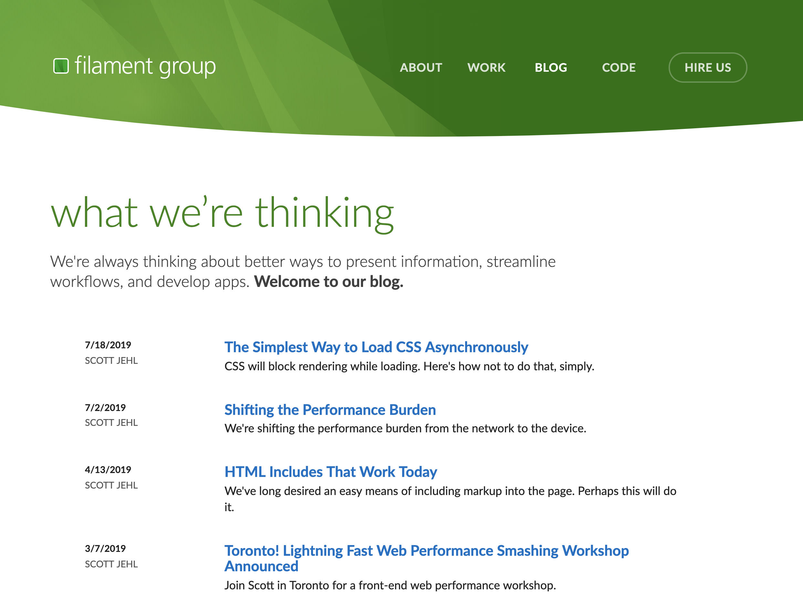
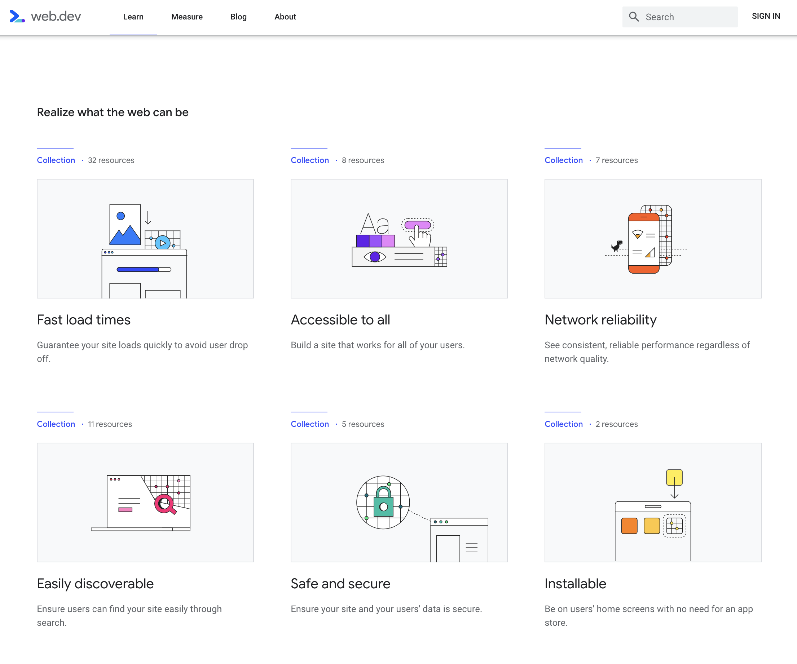
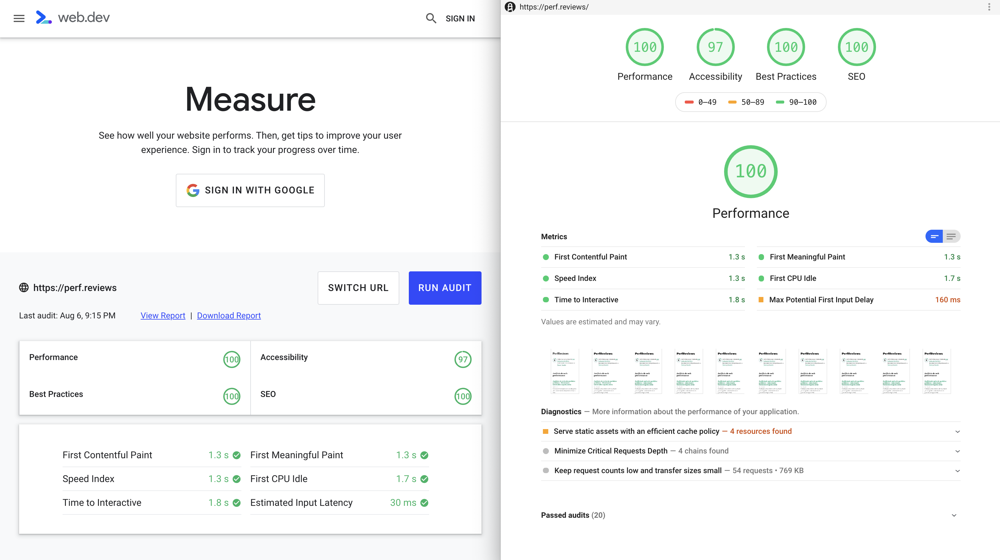
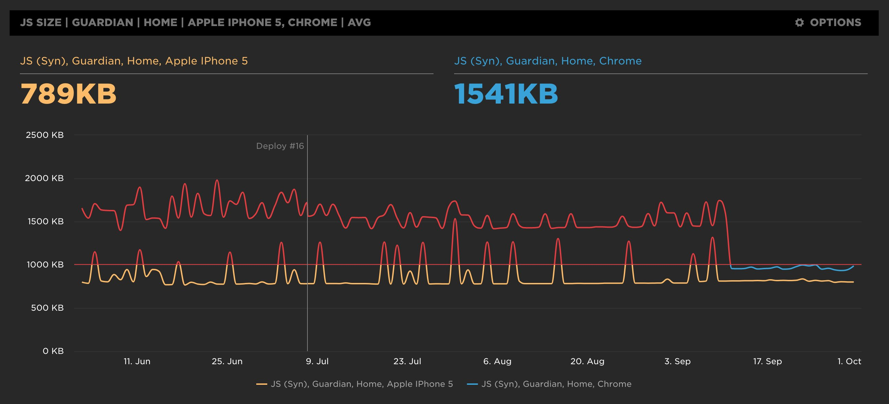

¿Cómo mantenerse al día sobre rendimiento web? El mundo del desarrollo web cambia rápidamente y **la medición y optimización de la performance no es una excepción**. Con frecuencia nos encontramos ante nuevas herramientas, nuevas API y nuevas técnicas para construir webs que cargan rápido.

Y a menudo vemos que los equipos de desarrollo dedican poco tiempo a un campo que pensamos es muy importante. Desconocimiento y baja prioridad es un combo perfecto para que el rendimiento de una web quede de lado.

En Perf.Reviews tuvimos claro que nuestro objetivo era hacer presente la importancia de la performance web. ¿Por qué?

1. **Desconocimiento de las herramientas de desarrollador incluidas en el navegador**. Éstas son muy potentes y suelen ser suficientes para encontrar y corregir la mayoría de problemas.

2. **Ponerse al día sobre las mejores prácticas en web performance es costoso, en tiempo y dinero**. Requiere leer mucho, seguir las novedades y ponerlas en práctica.
Lo que hoy es una mejor práctica mañana puede que ya no lo sea. Algunos ejemplos son [la combinación de estáticos, domain sharding, inlining](https://www.youtube.com/watch?v=yURLTwZ3ehk), o [CDNs para estáticos propios](https://csswizardry.com/2019/05/self-host-your-static-assets/). Y además siempre tener en cuenta el balance entre el soporte de una funcionalidad, el market share de los navegadores y el coste de polyfills.

3. **Encontrar problemas de rendimiento es difícil** si no se conocen los detalles de cómo funcionan los protocolos de red, cómo el navegador prioriza peticiones y parsea su resultado o cómo afecta el tiempo de ejecución de un JS o el tiempo de procesamiento de una imagen.

[Nuestros vídeos](https://www.youtube.com/channel/UCNoF5_1loBFvW2lZXPxp8ww) y [artículos](/) tratan de dar respuesta a estos problemas con ejemplos prácticos. Mostramos el potencial de las herramientas de desarrollo de los navegadores y herramientas de terceros y los usamos para encontrar problemas en sitios reales.

## Blogs y Twitter

Una de las mejores formas de estar al día es seguir los blogs y cuentas de Twitter de los navegadores y de desarrolladores que abogan por crear sitios rápidos.

Hemos recopilado [una lista en Twitter con las principales cuentas](https://twitter.com/jmperezperez/lists/web-perf), y siempre es una buena idea suscribirse a los blogs de [Addy Osmani](https://addyosmani.com/blog/), [Doug Sillars](https://dougsillars.com/blog/), [Filament Group](https://www.filamentgroup.com/lab/), [Harry Roberts](https://csswizardry.com/) o [Tim Kadlec](https://timkadlec.com/remembers/).

<small>_El blog de Filamnet Group es una buene fuente de información sobre técnicas de carga de CSS y fuentes._</small>

Una de las mejores fuentes para aprender sobre web performance es [Web.dev](https://web.dev/learn).

<small>_Colecciones de tutoriales y guías sobre web performance, accessibilidad, seguridad o PWAs entre otros en [Web.dev](https://web.dev/learn)._</small>

Este sitio de Google recoge información que antes estaba dispersa en distintos sitios y que ahora está consolidada a través de prácticas guías.

## Herramientas

Para detectar problemas de rendimiento lo mejor es hacer una auditoría web. Desde el mismo navegador [se puede realizar un análisis rápido](https://perf.reviews/tools/1.2-Interpretando-Lighthouse-Performance/), y también hay webs como [web.dev/measure](https://web.dev/measure) que generan un informe detallado del rendimiento de una URL en particular.

<small>_Informe de performance de perf.reviews utilizando la versión online de Lighthouse en [web.dev/measure](https://web.dev/measure). Vista general y vista de informe._</small>

Una herramienta recomendable es [WebPageTest](https://webpagetest.org), que también sirve para encontrar problemas de rendimiento. Es especialmente útil para comparar diferentes sitios, y también para personalizar qué navegador se va a usar, velocidad de red, dispositivo y ubicación de los servidores que medirán el rendimiento.

<small><i>Comparando dos sitios web con WebPagetest (ver <a href="https://webpagetest.org/video/compare.php?tests=190806_6C_4dfe18792032f032582a9a9c5f4229b8%2C190806_TN_6f590d67ba343e393013c847faa7c732&thumbSize=200&ival=1000&end=visual">informe</a>). Vista del filmstrip.</i></small>

A través de sus opciones avanzadas también se puede [comprobar el impacto de 3rd party scripts](https://andydavies.me/blog/2018/02/19/using-webpagetest-to-measure-the-impact-of-3rd-party-tags/), simular [single point of failures (SPOF)](http://blog.patrickmeenan.com/2011/10/testing-for-frontend-spof.html) y [mucho más](https://deanhume.com/ten-things-you-didnt-know-about-webpagetest-org/). Incluso [tiene una API](https://css-tricks.com/use-webpagetest-api/) para poder hacer todo esto desde scripts.

Otras herramientas dan informes específicos sobre optimización de imágenes, como [Website Speed Test de Cloudinary](https://webspeedtest.cloudinary.com/), o CSS con [CSS Stats](https://cssstats.com/).

Además de hacer auditorías es importante medir frecuentemente cuál es la experiencia de usuario con herramientas RUM. Algunas de las que hemos utilizado son [SpeedCurve](https://speedcurve.com/), [Pingdom](https://www.pingdom.com/product/performance-monitoring/), [mPulse de Akamai](https://www.akamai.com/uk/en/products/performance/mpulse-real-user-monitoring.jsp) o desde hace poco [Firebase](https://firebase.google.com/docs/perf-mon), del que [Carlos Villuendas hizo un práctico tutorial](https://www.youtube.com/watch?v=y2EeeWSfnRw).

Otras herramientas analizan periódicamente las webs que indiquemos y nos alertarán cuando alguna de las métricas empeora sustancialmente. Recomendamos [Calibre](https://calibreapp.com), [DebugBear](https://www.debugbear.com), [SiteSpeed](https://www.sitespeed.io/) y [SpeedCurve](https://speedcurve.com/).

<small>_SpeedCurve mostrando performance budgets para desktop y móvil de la web de Guardian._</small>

## Libros

Os puede extrañar que añadamos una sección de libros en un post donde estamos hablando de "mantenerse al día".
Los libros, aun en formato digital, son muy complicados de actualizar. Lo que les deja fuera de juego en la gran carrera en la que estamos inmersos.

<small>_Estos son algunos de los libros más populares de web performance, publicados entre 2008 y 2019._</small>

Aún y así, queremos haceros unas recomendaciones de algunos libros que os pueden ayudar a aprender unas buenas bases en web performance, protocolos y optimizaciones de recursos:

1. **[Web Performance in Action](https://www.manning.com/books/web-performance-in-action)**, escrito por [Jeremy L. Wagner](https://twitter.com/malchata) es el libro más completo de nuestras recomendaciones. Está enfocado en la web performance en general, cubriendo temas como la utilización de herramientas, optimización de CSS, JS e imágenes, la carga de fuentes de una forma efectiva, mejorar la performance utilizando Service Workers o una vista al protocolo HTTP/2. Una serie de puntos que nos harán conectar entre sí, mucha información que hemos ido adquiriendo desde diferentes fuentes durante mucho tiempo.

2. **[High Performance Mobile Web](https://www.amazon.com/High-Performance-Mobile-Web-Optimizing/dp/1491912553)**, este libro está escrito por [Maximiliano Firtman](https://twitter.com/firt), y como su título indica, está enfocado a la web performance en los dispositivos móviles. Empieza introduciéndonos en el mundo web móvil, pasando por cómo y qué herramientas de medición tenemos disponibles para dispositivos móviles, la optimización de primera visita, así como de las posteriores, donde aparecen de nuevo los Service Workers. Como es de esperar, dedica un capítulo a "Responsive Web Design" y uno muy interesante con título "Extreme Mobile Web Perfromance", donde aporta una serie de consejos más específicos para mejorar el rendimento de nuestras webs para esos dispositivos.

Es un libro a tener muy en cuenta, ya que estamos en un momento donde la mayoría de productos son **Mobile First**, incluso ya hay algunos que son **Mobile Only**.

3. **[High Performance Browser Networking](https://www.amazon.com/High-Performance-Browser-Networking-performance/dp/1449344763/ref=sr_1_1)**, el subtítulo que añade [Ilya Grigorik](https://twitter.com/igrigorik) a este libro es "Lo que todo desarrollador web debe saber sobre las redes y el rendimiento web", y su contenido no nos defraudará. Con un contenido super interesante podremos aprender desde el ancho de banda, latencia, bloques TCP y UDP, TSL, el funcionamiento de las redes WiFi y de redes de datos móviles, también nos habla sobre los protocolos HTTP/1.X y HTTP/2 y de cómo optimizar la entrega en estos protocolos. En la última parte del libro aprenderemos sobre XMLHttpRequest, CORS, Server-Send Events, WebSockets y WebRTC.

Un título de obligada lectura para todas aquellas personas que quieran mejorar los conocimientos en todo lo relacionado con redes y su rendimiento. Ah! otra de las cosas interesantes de este libro es que lo podemos leer de forma gratuita online en [hpbn.co](https://hpbn.co), gracias **Ilya**.

4. **[Using WebPageTest](https://www.amazon.com/Using-WebPageTest-Performance-Testing-Novices/dp/1491902590)**, en esta ocasión os recomendamos un libro sobre una herramienta, **la herramienta** para mucha gente. [Rick Viscomi](https://twitter.com/rick_viscomi), [Andy Davies](https://twitter.com/andydavies) y [Marcel Duran](https://twitter.com/marcelduran) nos presenta este libro en 3 partes: Básica, Intermedia y Avanzada, donde nos explica desde cómo utilizar WebPageTest para detectar qué hace lenta nuestra web, pasando por configuraciones para dispositivos móviles y scripting, hasta la parte más avanzada, donde aprenderemos a trabajar con la API y poder integrarlo con nuestra herramienta de integración continua. En el último capítulo nos muestran cómo implementar WebPageTest en nuestra propia instancia privada.

5. **[High Performance Images](https://www.amazon.com/High-Performance-Images-Shrink-Deliver-ebook/dp/B01MG9CFXG)**, este es el preferido de Joan 😉. Escrito por varios autores, [Colin Bendell](https://twitter.com/colinbendell), [Tim Kadlec](https://twitter.com/tkadlec), [Yoav Weiss](https://twitter.com/yoavweiss), [Guy Podjarny](https://twitter.com/guypod), [Nick Doyle](https://twitter.com/njdoyle) y Mike McCall nos ofrecen un conocimiento profundo de las imágenes. Empezando por la teoría de las imágenes digitales, los diferentes formatos de compresión tanto con pérdida, como sin pérdida, optimización de SVG, lazy loading, procesamiento de imágenes a nivel de GPU, una eficiente manera de preparar nuestras imágenes responsive, una eficiente manera de entregar nuestras imágenes al navegador y cómo implementar nuestro propio flujo para optimizar las imágenes de forma automática.

En esta ocasión, y gracias a [Akamai](https://www.akamai.com/es/es/) también tenemos una versión gratuita en formato [PDF](https://content.akamai.com/pg6293-high-performance-images-ebook.html).

## Auditoría personalizada y formación

Somos conscientes de que es difícil formar equipos en web performance y adoptar una cultura de equipo adecuada. A través de nuestro [servicios de workshops y auditorías personalizadas](https://perf.reviews/servicios/) ayudamos a empresas a entender los problemas de rendimiento de sus webs y dar los pasos para corregirlos y evitarlos en el futuro.
