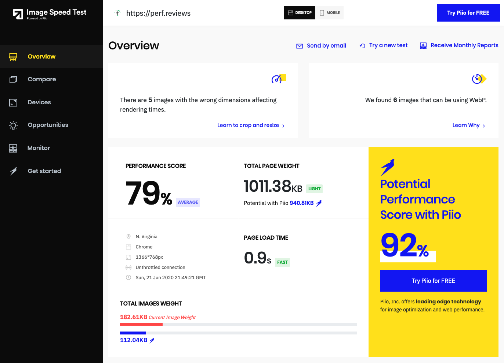

**[Piio](https://piio.co/?utm_source=Blog&utm_medium=referral&utm_campaign=PerfReviews)** is an image transformation service that lets you serve images with the appropriate size and format with a simple integration. Piio recently released [Image Speed ​​Test](https://imagespeedtest.piio.co/?utm_source=Blog&utm_medium=referral&utm_campaign=PerfReviews), which generates reports on potential image enhancements for any website.

We talked to [Nico Bistolfi](https://www.linkedin.com/in/nicolasbistolfi/) about the philosophy behind Piio, what makes it special, and why it is necessary to automate web performance related tasks. The interview is in Spanish, and the [video is available on Youtube](https://youtu.be/SLzhWFU52WQ). You can also listen to [the audio on MP3](./interview.mp3).

<iframe width="560" height="315" src="https://www.youtube.com/embed/SLzhWFU52WQ" frameborder="0" allow="accelerometer; autoplay; encrypted-media; gyroscope; picture-in -picture "allowfullscreen> </iframe>

## Transcript of the interview

**Jose**: Hello! At Perf.Reviews we like to share tips to improve web performance and we talk about different techniques, different browser APIs and also different services. One of the topics that we are going to deal with today is images and how we can use services to correct problems with images that are usually quite tedious.

My name is José Pérez and Joan León accompanies me as always

**Joan**: Hello, how are you?

**Jose**: Very good! And we have the great pleasure of speaking today with Nico Bistolfi, who is CEO and co-founder of Piio. Hi Nico!

**Nico**: How are you doing? Thank you very much for the invitation.

**Jose**: Very well, thank you for being with us today. First and foremost, let's talk about Piio. What is Piio?

**Nico**: Our main product is an image optimization service with a very simple installation. It is primarily for websites, and we are not focused on apps yet. What we are going to achieve, and what our service is going to achieve, is to apply all the techniques and best practices for image optimization on your website [through a JavaScript library](https://docs.piio.co/?utm_source=Blog&utm_medium=referral&utm_campaign=PerfReviews).

**Jose**: Very well, and I understand that on mobile there is also a similar problem, that you have to serve images adapted to mobile, but at the moment you are focused on the web.

> On the web we are more advanced than native apps in terms of data transfer. I think apps have an important way to go. - Nico

**Nico**: Yes, correct. What you see, and you see it as a user, is that sometimes on mobile perhaps the performance is not as measured or they do not see it as so important. We see it in applications such as Instagram for example, which has a data transfer totally disproportionate compared to any other application, and yet there has been no improvement in recent years. I think that, on the web, we are a little more advanced in the performance process and in optimizing the user experience at the speed level. Mobile applications have other advantages, such as having better animations, perhaps they need to load the styles once they are installed. But at the transfer level, I think they have an important way to go.

**Joan**: It's interesting that there is more sensitivity on the web in that regard than on mobile.

**Nico**: I think it can also be due to the type of devices we are talking about or the type of devices that users use. At best on mobile they do not care so much about low-end devices and the user already understands that there are a lot of applications that they will not be able to use and will not be able to access. On the web I think that in the last 10-15 years a lot of work has been done on accessibility and that the web has to work for any device. A native application that will not load you on your cell phone, you enter the same service on the web and it will work better.

### The origin of Piio

**Jose**: And how did you start the project? THere are development teams internally in some companies that try to create some kind of service in order to transform images. Is it something that you started to develop being within another company or did you directly think “this is something we want to do” and you started it externally?

> Piio creates a standard to abstract the developer from image problems and fix them once and for all - Nico

**Nico**: It actually comes from my professional career as a developer. I started in one of those teams and I was working for a social network about 15 years ago. I was based in Europe and that's when I started to make my first attempts to optimize multimedia content. It always caught my attention. In between I wrote some open source libraries to connect AWS services such as S3 or Elastic Transcoder.

In 2018 I started to think about Piio as a very simple tool to optimize images and to really solve all the problems that developers have. Optimization has to be continuous. Many times what happens is that you generate a new version of the website, the appropriate tests are carried out, you begin to detect the problematic assets... That is solved and 3 weeks later, 3 releases later, everything goes back. We have to achieve a standard and, although we have made a lot of progress on the web, there are still things to be polished. What we are looking for from Piio's technology is precisely to create that standard that abstracts the developer from those problems and solves them once and for all.

### What functionality does Piio support

**Joan**: You have mentioned that the optimization of all media content caught your attention. Piio is currently focused on image optimization. In any future do you plan to also support video optimization?

**Nico**: It is in our backlog. We are based on the user's needs. If you sit down as an engineer in front of the computer and start to think about the features that an image optimization service should have, you would think that _crop_ is something fundamental. Or suddenly you want to make transformations by changing its center.

However what we see when we talk to the end user is that these features don't even end up being used. In the process of taking an image from the photographer, to production, editing, designers and reaching the platform, a process has already occurred that does not need to be done again.

We have a _crop_ functionality that we launched not too long ago. Much of the life of the company we were selling the service without the _crop_ functionality specifically because it is not among the problems of optimizing images for a website. It is part of the problem of image processing.

Going back to whether we want to make videos or not, we are identifying other things in website optimization or cloud optimization, where we are starting to position ourselves and focus. They may be perhaps more necessary than the video part, which today is a fairly small segment.

**Joan**: It is interesting.

### Differences from other image optimization services

> We offer a complete service and requires little action from the developer - Nico

**Jose**: If someone has used other similar image services, they may wonder what is the difference between Piio and a service where I can use a url and pass it to certain parameters, for example, to do a scaling. Piio works by installing a small JavaScript and making a small change in the image markup. What is the main difference or what is your approach?

**Nico**: One of the things we say is that we are a service because it is a complete service and does not require much more action on your part. On the other hand, when you use an image optimization API the optimization work is manually done by the developer. If you want to optimize for the iPhone X you are going to have to run a specific test for the iPhone X, you are going to have to see how the images are being generated and add lines of code for each different device that you want to optimize optimally. That leads you to not be able to cover all the cases or that you cannot think in the future what is going to happen with the devices.

An example is the [device pixel ratio](https://developer.mozilla.org/docs/Web/API/Window/devicePixelRatio). Until a few years ago we had 1 to 1 (ratio of physical pixel to CSS pixel) and we didn't have to think about it. Then when the retina displays came out the designers started generating images in two sizes: one for retina and one for normal devices. And nowadays you have device pixel ratio that are 2.75, 3.5, and it varies according to the device that the user is using. It is super difficult to plan and carry it manually.

Our installation is super simple, including the Piio integration code snippet, and changing the HTML, which is simply the same change you would make if you were integrating a lazy loading library. And it ended there. The library will understand at browser rendering time how your styles are being interpreted and what will be the exact size of that container. The library is going to call our APIs and do the optimization in real time.

### Optimizing CSS background images

**Jose**: Something Joan and I have seen analyzing websites is that when someone is using an img tag it is relatively easy to transform it into a picture or srcset to make it responsive image. But the subject of the images that were added using CSS, with a background-image, was always pending. If we saw that there was a performance problem there, the solution was not so easy because to adopt a solution similar to responsive images you had to be overwriting CSS rules or you had to convert it to an img tag. It is something that you can manage.

**Nico**: Yes. What we recommend in this case is [move the assignment of the CSS asset towards the div or the element where you want that background to appear](https://blog.piio.co/image-optimization/how-to-use-optimized-responsive-images/?utm_source=Blog&utm_medium=referral&utm_campaign=PerfReviews). It is done with a simple directive and from there it is optimized for the different sizes with which that element will be rendered in the browser.

### CPU and latency increases when using this type of solutions

**Jose**: For a time there was a bit of hesitation with using JavaScript to serve images because they could introduce a little latency. I stopped taking advantage of the initial parsing that can make image requests a little earlier. Nowadays we are all going to lazy loading which either needs JavaScript or is very limited to certain browsers that implement it natively. What initially could be a problem when adding that initial latency, is actually an advantage quite soon. Instead of loading 40 images you can load only the two or three that are inside the viewport. You guys also do lazy loading in your library, right?

> The conclusion has been drawn that "more JavaScript is worse". What you need to ask yourself is "what kind of JavaScript am I incorporating into my page?" - Nico

**Nico**: Yes, correct, it is already incorporated by default and we also have different configurations. We are finding that there is a contradiction between what could be the best user experience and what Google marks as the most positive for the user. Google mainly cares about the [First Contentful Paint](https://web.dev/first-contentful-paint/) or the page load time. However, when you work more aggressively with lazy-loading to improve these metrics, the user will have a slightly worse experience, because sometimes scrolling you see that the images start to appear suddenly and you would like that to be already there.

Our service has the option that you can configure how you want it to work: if you want it to be more aggressive or less aggressive. What a person has to measure is what is going to be more important, if SEO or user experience is better positioned.

We have measured the CPU time footprint and it is practically non-existent. Processing time on a Macbook is 0.4 milliseconds. We have also done many benchmarks between those using the API directly and those using the library, and there is no difference in load times.

Some people are afraid of incorporating JavaScript libraries because there are many libraries that are not optimized or working properly. Go with the templates in Shopify or Wordpress, or trillions of libraries simply to make them have prettier animations and make it easier to sell. Then this ends up affecting the user experience and the wording "more JavaScript is worse." The question to ask is "what kind of JavaScript am I incorporating into my page?"

### Lazy Loading and SEO

> "It is very difficult to isolate to a single variable the impact on the SEO of your page or on the experience of your users" - Nico

**Joan**: Do you see any patterns or trends about being more or less aggressive in lazy loading? For example, transition from more aggressiveness to making the user experience smoother.

**Nico**: The problem is that there we fall into the SEO school. We know that within SEO there are many things that are subjective and are not necessarily strictly tested. It is very difficult to isolate the behavior or the impact that it will have on the SEO of your page, or even the impact that it can have on the experience of your users, to a single variable. What I can answer you is that we have no evidence that one thing is more positive than the other.

**Jose**: I think that sometimes you also try to optimize a lot of SEO and do “what Google likes”. It is better to offer a good user experience because that means that the user will like the page more, they will share it more and it will generate more traffic in some way. Optimizing for Google is something you can do at any given time with the guidelines they give, which are not very obvious either, but it is something that is always changing. I think that in the end what they do is try to evaluate the page in such a way that they simulate what the user is going to feel. Putting keywords in a meta tag, or serving a different version for Google is a worse solution than making a version that works well for everyone, and that Google is only one more user.

In this sense, if a change is made in the marking of the images, Google does not discover them in the first pass. You have to wait for a second pass where you run JavaScript to see those images. Still, the benefit of having a faster load for the user will improve the number of links that exist to that page or perhaps other variables within the great algorithm of Google. Perhaps it is a better option than having to load 10 megabytes of images.

**Nico**: Many of us use PageSpeed ​​Insights to measure, and we use it internally. There they talk to you about lazy loading and say "we identified certain images that should be using lazy loading" and that's where the person "I have to be a little bit more strict with lazy loading". It depends on whether the person prefers to focus on SEO and focus 100% on what PageSpeed ​​Insights is saying, or prefers to prioritize the user experience and make it a little more organic.

### The typical Piio user

> "The one that prioritizes website optimization and how important SEO or metrics is is primarily the area of ​​marketing" - Nico

**Jose**: What would you say is the main type of Piio users? E-commerce, blogs, news sites...

**Nico**: Initially one might think that the engineering team would be the team that would have to be concerned with optimization. But as developers we know that engineering is a very supportive area and that it responds to the needs of other areas. The one that prioritizes website optimization and how important SEO or metrics is is primarily the area of ​​marketing. What we see many times is that the first people we talk to are from the marketing area and then we include the technology team, if they have one to continue advancing the solution.

**Jose**: Do you think there should be more engineering in the marketing teams?

**Nico**: Whenever I speak to someone who works in the marketing area, I ask how much they know about code. And they are learning, they are beginning to understand much more than what a website or an engineering process means. They are areas that work closely together and today there are tools that are empowering the marketer so that they can be more independent in the area of ​​engineering.

**Joan**: I think you have used the keyword which is to be more independent. When they have dependencies on other teams and try to be more independent, then they seek that autonomy trying to have more knowledge and looking for the tools themselves. It is clear that the more they know about the technical part, the better they will be able to value those tools, the better they will be able to configure them, and in the end, improve the user experience, which is what really matters.

**Jose**: I see a lot of marketing team adding scripts without knowing what the impact is. I would appreciate more than once having an engineering person closer to those teams who understands the implication of giving so many facilities to a marketing team so that it does not have an engineering dependency. With that autonomy also comes a responsibility. They may be adding a lot of latency and other problems to the web and perhaps they are not realizing it.

**Nico**: Yes, correct.

### Potential savings reports on images using Image Speed ​​Test

> "In the tests of Image Speed ​​it is important to be able to give the user certain parameters and speak in a natural language so that he does not get frustrated along the way" - Nico

**Jose**: You recently launched a service that reports on the profit you can get by improving the images called [Image Speed ​​Test](https://imagespeedtest.piio.co/?utm_source=Blog&utm_medium=referral&utm_campaign=PerfReviews).

**Nico**: The main objective of the service was to focus on optimizing images, so that they can see what the north is and that they can have a compass where to go and know what the potential is. As you work on optimization you wonder how far I can go. There are limitations of the platforms themselves that will not allow you to suddenly download at an ideal time of 1.5 or less than 3 seconds of loading. It is important to be able to give certain parameters and speak in a slightly more natural language to the person who is doing these tests so that they do not get frustrated along the way.

What we were looking for was to do a test on the website and see what the main things they have to work on are image optimization. On that we try to calculate what the final result would be if the person used all the practices that exist today. We give an initial performance score and we give a potential performance score that is what would result if they were optimizing the images. About each of these images we tell you if it could be in a certain format, have a certain size, or by using lazy-loading you could save x amount of requests on your page. This allows the person to have a guide on how to follow.

> "If you don't have a standard that allows you to automate optimization, you're going to be left behind at the same time, or depend on manual work" - Nico

**Jose**: I really like that you have included a section with some great brands and what the potential savings are. One would think that those brands would have everything already optimized because they have resources for it. It is quite quite curious to see the savings percentages of large companies. Somehow you get calmer when you see that your small page has performance problems and you see that large sites also have it. It is something that happens everywhere.

**Nico**: It is related to what we mentioned at the beginning. If you do not have a standard that allows you to do an optimization automation, then you will be left behind after having done that optimization, or depending on manual work. There will always be something that will be working better.

There are many sites, large ones, that do not yet use WebP for compatible browsers. And that is incredible because it has been around for quite some time and they are large companies that one would suppose have the capacity. But it also depends on whether they have the time to focus on that problem, whether someone is really identifying it and _posting_ for the change to be made. I think all sites suffer from the same problem. Sometimes we see it in greater magnitude and in smaller magnitude. perhaps the systems

> "We simplify the process and take tasks from the developer so that the optimization of images is maintained for a longer time" - Nico

**Jose**: The big ones have more organizational problems or it is more difficult to make these kinds of changes than in a smaller company where they can be done without having to ask for authorization from six people from different teams.

**Nico**: That can and can also be the knowledge management part. That an engineer six months ago was doing the optimization task, and that engineer may have gone somewhere else or is working on something else. Then someone else grabs it and makes changes or does not agree with what was being done.

If we simplify the process and take tasks from the developer that must be done for optimization, we will be making it stay longer. In our service we give the possibility of validating each of your pages. Once you add your domain you can add the pages that you want to be tracking and validate, and we are going to run a simulation and we are going to tell you, including using our library, what are the things that you could improve within your page.

Things like [an image that is hidden and shouldn't be asking for](https://blog.piio.co/website-speed/how-css-display-none-affects-images-on-page-load/?utm_source=Blog&utm_medium=referral&utm_campaign=PerfReviews), or an image that is showing a size that shouldn't be because maybe the CSS styles are so bad or missing. We also give those recommendations within the service so that people can continue working.

### Image Speed ​​Test, a free tool

> "Image Speed ​​Test is free and the free Piio plan will be more than enough to make it work and optimize the page" - Nico

**Joan**: One thing that we have not commented on is that Image Speed ​​Test is free.

**Nico**: Yes. Also, for a personal site or a small company [the free Piio service](https://piio.co/pricing/?utm_source=Blog&utm_medium=referral&utm_campaign=PerfReviews) it will be more than enough for it to work and optimize the page.

**Joan**: That will also help expand the performance culture. Tools like this, and what we are also doing this channel, aims to expand sensitivity about performance. To finish we wanted to ask you about the future of Piio. Where are you going

> "We want to generate a better Internet experience and make it an accessible tool for everyone regardless of the device you have" - ​​Nico

**Nico**: We are making the transition from startup to having a leading product such as image optimization, to establishing a suite of products. And that is what we are working on today. Our main focus is going to be cloud performance. The products that we are going to launch will be possible to use on any existing website and will surely help improve the performance of any website that is public. We look forward to launching it this year or early next year. I cannot make much disclosure of what the product is going to be because it is part of the job but we hope to continue our work on optimization, so we can build a better internet and that people have a better experience.

Generating not only a better internet experience in itself, but also making the internet an accessible tool for everyone regardless of device. Whether it is the last iPhone or an Android from 2010, it is important that you can access that information, which is part of the world heritage.

**Joan**: Perfect. We will follow closely Piio and try out the new features that you launch.

**Jose**: Thank you very much Nico for joining this interview and we hope the best for Piio.

**Nico**: Thank you very much for the invitation.

**Joan**: Greetings!
