Ya hemos dejado atrás Google I/O 2019. Un evento repleto de novedades relacionadas con web performance que harán más fácil encontrar y solucionar problemas de rendimiento.

Ésta es una lista no exhaustiva de las nuevas herramientas y funcionalidades presentadas.

## LightWallet

_Presentado en [Speed at Scale: Web Performance Tips and Tricks from the Trenches](https://youtu.be/YJGCZCaIZkQ?t=101). Mencionado también en [Demystifying Speed Tooling](https://www.youtube.com/watch?v=mLjxXPHuIJo?t=73)._

[LightWallet](https://bit.ly/lightwallet-docs) añade soporte para _performance budgets_ en Lighthouse y está disponible en la versión de línea de comando de Lighthouse.

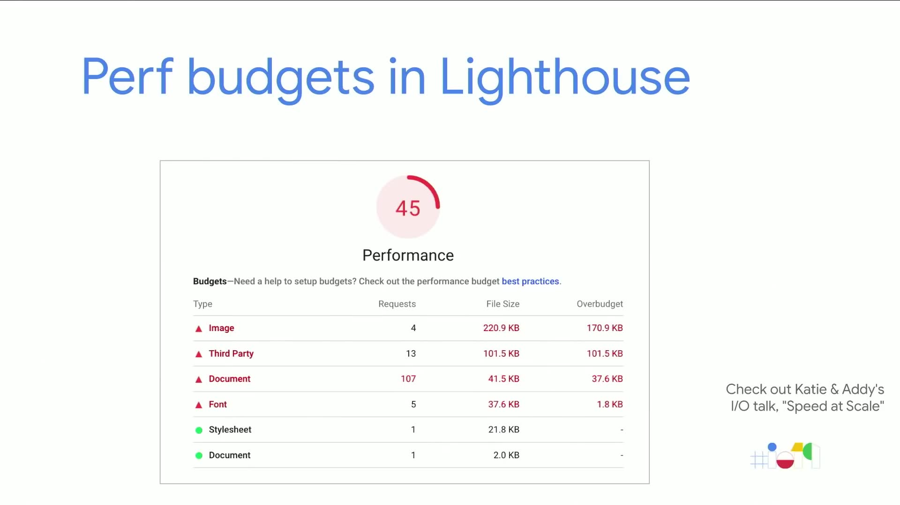

LightWallet añade una sección de "Budgets" en el informe de Lighthouse. Esta sección agrupa los recursos de la página y muestra en rojo el exceso de peticiones y/o de kBs.

Esto lo hace ideal para entornos de Continuous Integration. Para configurarlo basta con añadir un archivo `budget.json` que define los budgets de performance.

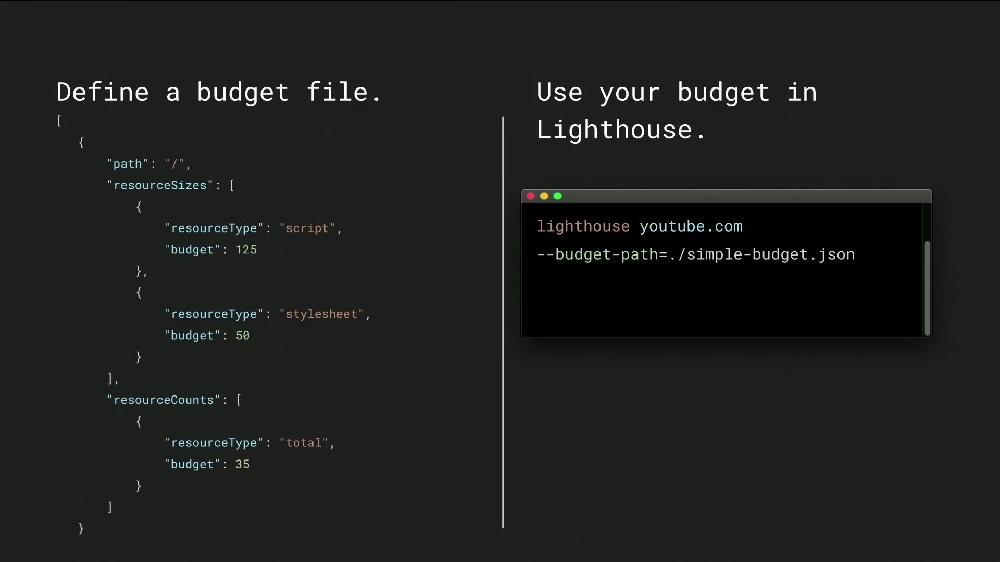

## Lighthouse Stack Packs

_Presentado en [Demystifying Speed Tooling](https://www.youtube.com/watch?v=mLjxXPHuIJo?t=330)._

Lighthouse proporciona a los desarrolladores consejos para mejorar las webs al hacer análisis de rendimiento, accesibilidad y buenas prácticas.

Muchos desarrolladores hoy en día utilizan diferentes tecnologías (backend / CMS / frameworks JavaScript) para construir sus sitios web. En lugar de mostrar recomendaciones generales, ¿qué pasaría si Lighthouse también pudiera proporcionar consejos más relevantes y útiles en función de las herramientas utilizadas? Un ejemplo es utilizar un determinado plugin para mejorar el rendimiento de un sitio que usa Wordpress.

Lighthouse ahora puede detectar qué plataforma usa una web y ofrecer consejos específicos para mejorar el rendimiento a través de [Stack Packs](https://github.com/GoogleChrome/lighthouse-stack-packs).

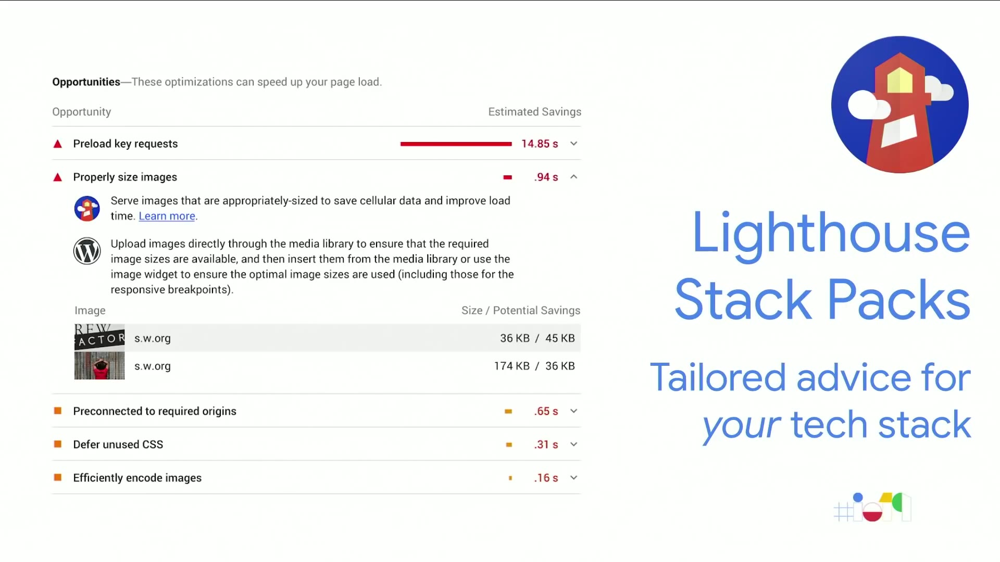

## Lighthouse Plugins

_Presentado en [Demystifying Speed Tooling](https://www.youtube.com/watch?v=mLjxXPHuIJo?t=2000)._

Los plugins de Lighthouse permiten extender la funcionalidad de Lighthouse para necesidades específicas.

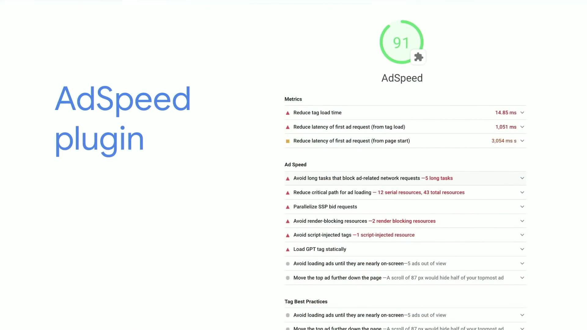

Los plugins son módulos NPM que implementan una serie de chequeos que son ejecutados por Lighthouse y añadidos como una sección adicional. Un ejemplo es el plugin [Publisher Ads](https://github.com/googleads/pub-ads-lighthouse-plugin) (antes llamado AdSpeed) que Google ha desarrollado para mejorar la integración de su plataforma de anuncios.

Además, pronto será posible escoger qué plugins ejecutar desde las DevTools.

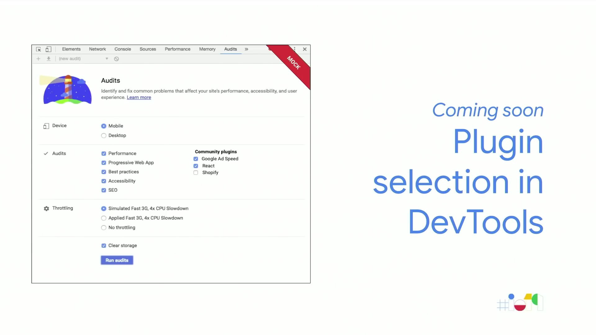

## Nuevo diseño de Lighthouse

_Presentado en [Demystifying Speed Tooling](https://www.youtube.com/watch?v=mLjxXPHuIJo?t=391)._

El diseño del informe de Lighthouse ha cambiado ligeramente y también incluye ahora soporte para _dark mode_.

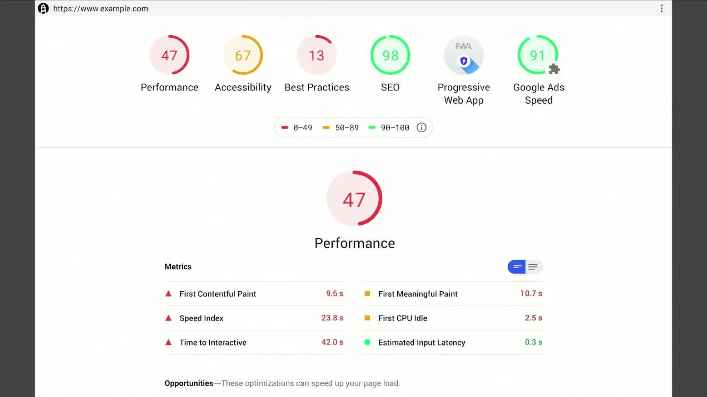

## Evergreen Googlebot

_Presentado en [Google Search and JavaScript Sites](https://www.youtube.com/watch?v=Ey0N1Ry0BPM)._

El bot que Google usa para indexar sitios seguía corriendo Chrome 41, una versión que se había lanzado en marzo de 2015. A partir de ahora, se actualizará para ejecutar la última versión de Chrome. Esto significa que Googlebot ahora soporta funciones como [IntersectionObserver o ES6](https://webmasters.googleblog.com/2019/05/the-new-evergreen-googlebot.html), que no estaban disponibles en Chrome 41.

Un aspecto positivo de Googlebot al ejecutar Chrome 41 era que los desarrolladores tenían que añadir soporte para navegadores más antiguos. La actualización de Googlebot no significa que ya no tengamos que preocuparnos por estos navegadores, ya que siempre debemos esforzarnos por dar al usuario una buena experiencia con independencia del navegador.

Dos cosas a tener en cuenta es que las herramientas de test como [Google Search Console](https://search.google.com/search-console) aún ejecutan Chrome 41 y se actualizarán en el futuro. Además, aunque Googlebot no ejecutará Chrome 41, seguirá anunciando esa versión en su user agent temporalmente. Esto dará tiempo a los desarrolladores web para hacer cambios en su código en caso de que estuvieran haciendo _user agent sniffing_ asumiendo que el bot se anunciaba como Chrome 41.

Servir ES6 y usar IntersectionObserver ayudará a reducir el tráfico de datos, y probablemente acortará los tiempos de carga. Esto es excelente para la experiencia del usuario, pero también para SEO, ya que Google usa el tiempo de carga como una de las métricas para hacer ranking de los sitios.

## Nuevas métricas de rendimiento

_Presentado en [Demystifying Speed Tooling](https://www.youtube.com/watch?v=mLjxXPHuIJo?t=575)._

A las ya conocidas métricas FP, FCP, FID y TTI se le añaden 2 más:

- **[Layout stability](https://bit.ly/layout-stability)**, que mide los cambios en el layout al cargar contenido que _empuja_ otros elementos y fuerza al navegador a recalcular la posición de los elementos.
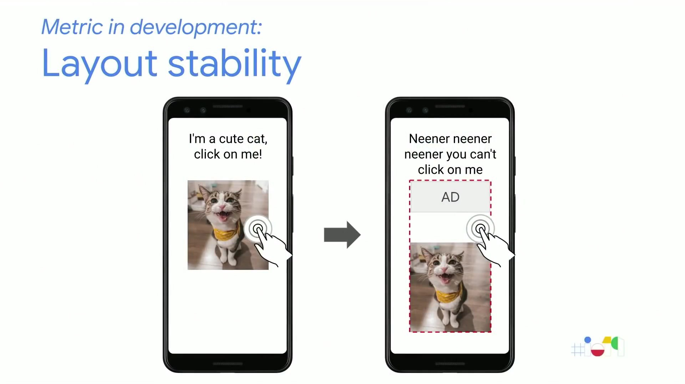

- **Largest Contentful Paint**, que mide cuándo se renderiza el elemento más grande, que sirve como aproximación al contenido principal de la página. Es una generalización de métricas usadas en el pasado para medir la carga de la Hero Image.
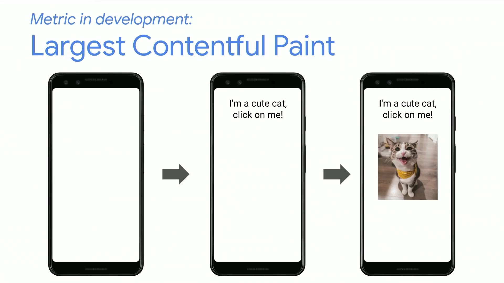

## Element Timing for Images

_Presentado en [Demystifying Speed Tooling](https://www.youtube.com/watch?v=mLjxXPHuIJo?t=1877)._

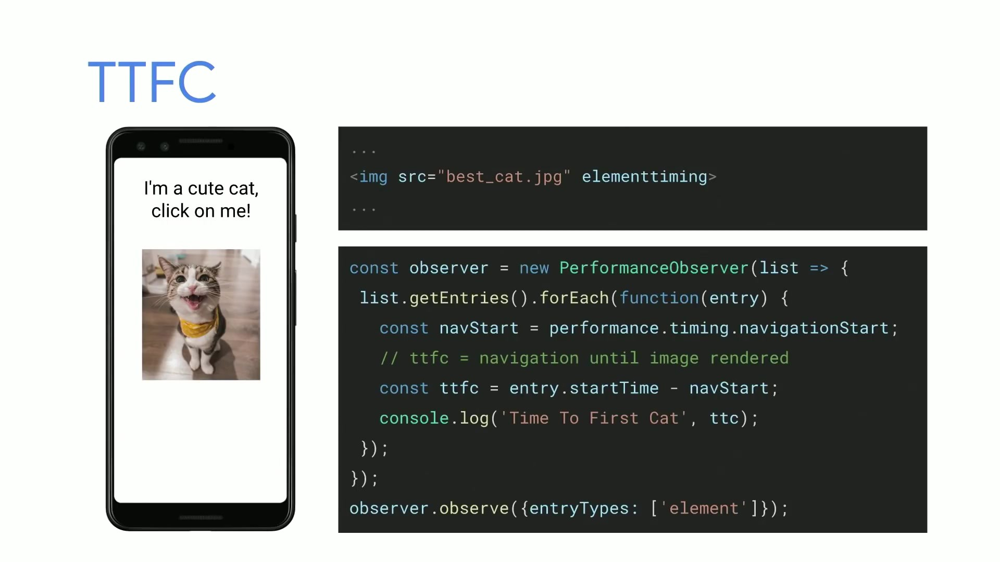

Ahora podemos obtener el tiempo de carga de imágenes utilizando el atributo `elementtiming`, que expone métricas que se pueden acceder a través de `PerformanceObserver`. Esto se puede utilizar para hacer seguimiento de una métrica _custom_ que nos sirva para medir el rendimiento de nuestra página. Un ejemplo es Wikimedia, que [querían medir el "time-to-logo"](https://phabricator.wikimedia.org/phame/post/view/19/improving_time-to-logo_performance_with_preload_links/).

## Lazy Loading nativo

_Presentado en [Speed at Scale: Web Performance Tips and Tricks from the Trenches](https://youtu.be/YJGCZCaIZkQ?t=543)._

Google Chrome va a soportar próximamente lazy loading nativo para imágenes.

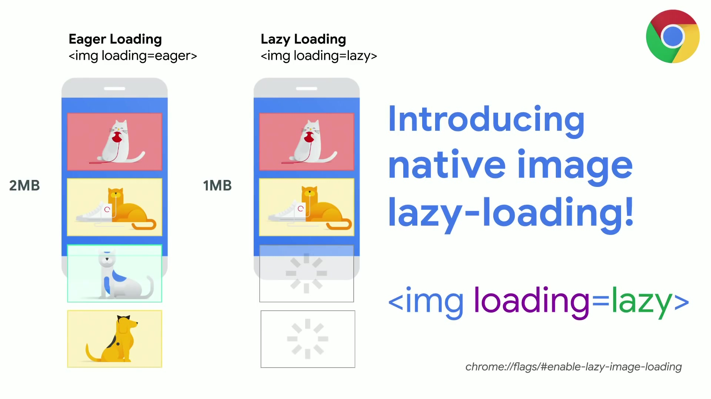

Y también para iframes.

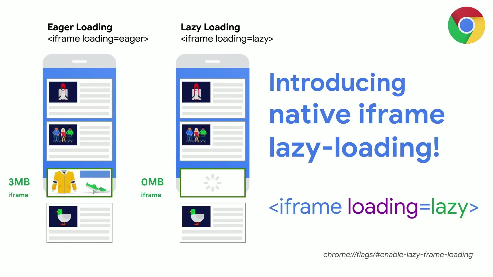

El nuevo atributo `loading` permitirá elegir si queremos aplicar la carga lazy (eg ``) o no (eg ``). Un tercer valor será `auto`, que dejará al navegador elegir el modo.

De esta forma no es necesario implementar lazy loading utilizando Javascript y podemos conseguir unos ahorros en tráfico y mejoras en performance sustanciales.

En la carga lazy el navegador hará la petición de iframes e imágenes que estén en el viewport y hará también peticiones parciales a las siguientes imágenes que estén fuera del viewport. Estas peticiones parciales tienen un tamaño aproximado de 2kB y permiten saber el tamaño de la imagen en píxeles para establecer placeholders y evitar reflows.

## Nuevo informe de velocidad en Google Search Console

_Presentado en [Demystifying Speed Tooling](https://www.youtube.com/watch?v=mLjxXPHuIJo?t=943)._

Google Search Console (antiguo Webmaster Tools) incluye un nuevo informe llamado Speed Report. Está basado en [FCP](https://developers.google.com/web/tools/lighthouse/audits/first-contentful-paint) y [FID](https://developers.google.com/web/updates/2018/05/first-input-delay) de _field metrics_.

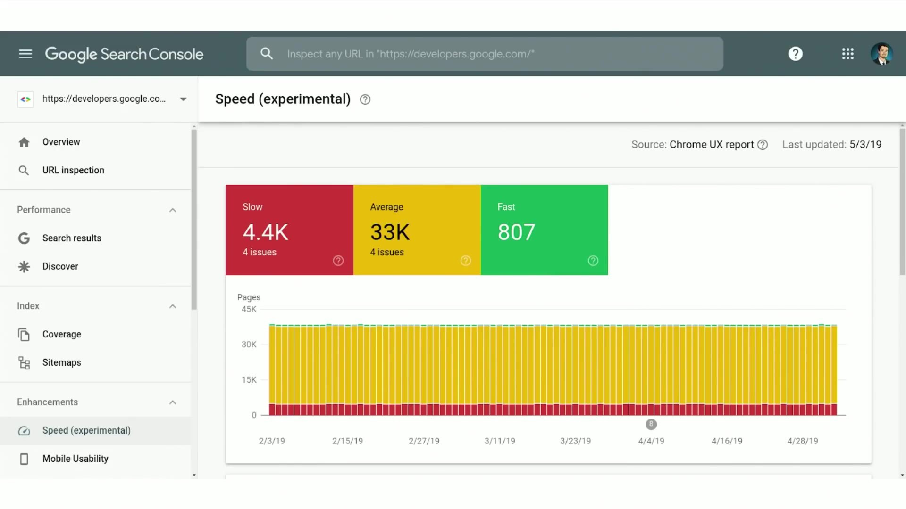

El informe sirve para monitorizar el progreso de estas métricas y su distribución (rápido, medio, lento) con el paso del tiempo. Recuerda al dashboard de CrUX pero con un reporte de métricas diario en lugar de mensual.

Además, el informe ayuda a priorizar qué mejoras llevar a cabo. Para ello agrupan todas las URLs afectadas por el mismo problema, indicando el potencial ahorro en tiempo.

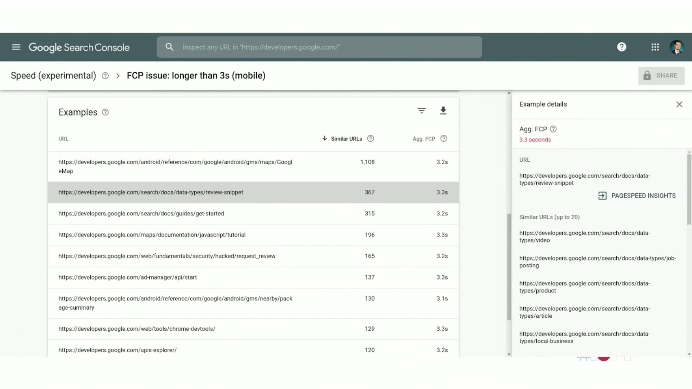

## Performance Budget Calculator

_Presentado en [Speed at Scale: Web Performance Tips and Tricks from the Trenches](https://youtu.be/YJGCZCaIZkQ?t=226)._

La [Performance Budget Calculator](https://bit.ly/perf-budget-calculator) permite prever el Time To Interactive (TTI) de una página basándose en 2 medidas: tamaño de recursos JS y tamaño de recursos no JS.

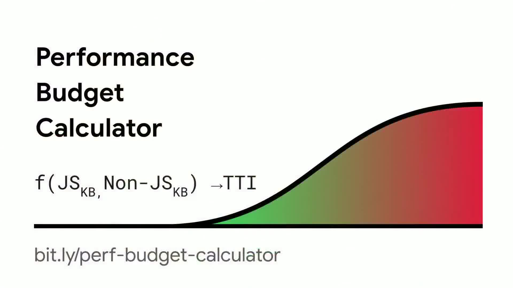

Los cálculos se basan en las correlaciones que Google ha encontrado analizando datos de 3,9 millones de páginas usando [HTTP Archive](https://httparchive.org/).

Además, la calculadora puede crear un fichero `budget.json` automáticamente para advertirnos cuando nuestros cambios en el código superan los límites establecidos.

## Firebase web performance monitoring

_Mencionado en [Demystifying Speed Tooling](https://www.youtube.com/watch?v=mLjxXPHuIJo?t=1630)._

Proporciona agregaciones de métricas de performance de usuarios reales (RUM) para páginas individuales. La gran ventaja es que muestra distribuciones de las métricas, no sólo la media como ocurre con Google Analytics.


Las métricas incluyen First Paint, First Contentful Paint y First Input Delay. Es posible filtrar por país y por tipo de conexión entre otros.

Para integrar el proyecto, echa un vistazo a [esta guía de iniciación](https://firebase.google.com/docs/perf-mon/get-started-web).

## Font-display en Google Fonts

[font-display](https://developer.mozilla.org/docs/Web/CSS/@font-face/font-display) es una funcionalidad de CSS que permite controlar cómo cargar las fuentes.

Google Fonts se usa en muchos sitios y, hasta ahora, no había posibilidad de establecer la estrategia de carga de la fuente. Ahora, gracias al parámetro query `display` podemos pasar uno de los posibles valores y Google lo aplicará en la regla CSS que devuelve.

La petición

```bash
https://fonts.googleapis.com/css?family=Calligraffitti&display=swap
```

devuelve

```css
/* latin */
@font-face {
  font-family: 'Calligraffitti';
  font-style: normal;
  font-weight: 400;
  font-display: swap;
  src: local('Calligraffitti Regular'), local('Calligraffitti-Regular'), url(https://fonts.gstatic.com/s/calligraffitti/v10/46k2lbT3XjDVqJw3DCmCFjE0vkFeOZdjppN_.woff2) format('woff2');
  unicode-range: U+0000-00FF, U+0131, U+0152-0153, U+02BB-02BC, U+02C6, U+02DA, U+02DC, U+2000-206F, U+2074, U+20AC, U+2122, U+2191, U+2193, U+2212, U+2215, U+FEFF, U+FFFD;
}
```

Aunque `font-display: swap` suele ser la opción más recomendada, otras opciones interesantes son `font-display: fallback` y `font-display: optional`, como explica Chris Coyier en [If you really dislike FOUT, 'font-display: optional' might be your jam
](https://css-tricks.com/really-dislike-fout-font-display-optional-might-jam/). También en CSS Tricks encontrarás la fantástica guía ['font-display' for the Masses](https://css-tricks.com/font-display-masses/).

## WebAssembly

_Presentado en [WebAssembly for Web Developers](https://www.youtube.com/watch?v=njt-Qzw0mVY)._

Esta presentación consta de dos partes. La primera donde Surma nos habla del uso de WebAssembly en [Squoosh](https://squoosh.app/), un optimizador de imágenes desde la web, que gracias a WebAssembly puede utilizar los codecs escritos en C y C++ para mejorar la velocidad de compresión de las imágenes. En la segunda, parte Deepti nos habla de las propuestas para poder utilizar varios hilos de ejecución en nuestras aplicaciones.

Surma hace especial hincapié en que como desarrolladores web no debemos preocuparnos por tener que desarrollar en C, C++ o Rust para trabajar con WebAssembly, y nos presenta [AssemblyScript](https://github.com/AssemblyScript/assemblyscript) que nos permite desarrollar con [TypeScript](https://www.typescriptlang.org/).

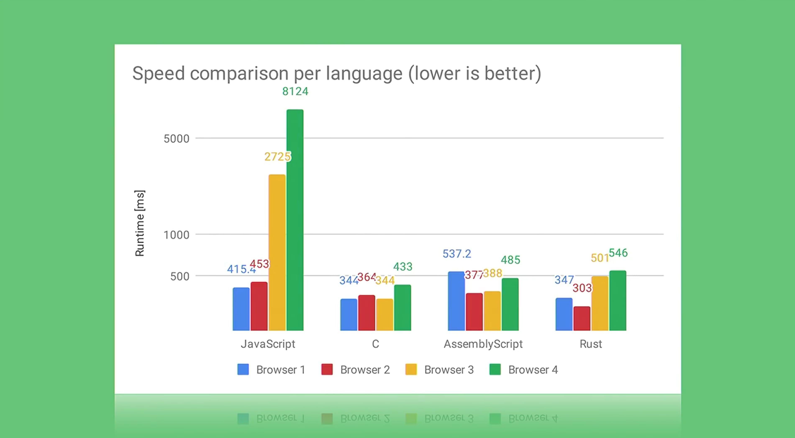

Con WebAssembly conseguiremos mejorar la velocidad de ejecución de las aplicaciones Javascript, mejorando así la experiencia de usuario.

## Portals

_Presentado en [From Low Friction to Zero Friction with Web Packaging and Portals](https://www.youtube.com/watch?v=Ai4aZ9Jbsys)._

[La nueva API Portals](https://github.com/WICG/portals) es una propuesta que, aunque no está relacionada directamente con mejorar la velocidad de carga de nuestras páginas, sí que lo está en la percepción que tendrá el usuario en las transiciones entre páginas.

Lo que nos permitirá hacer esta nueva API es cargar la página destino en un elemento similar a un iframe, y poder controlar una transición entre la página actual y la página destino.

<video controls autoplay loop muted style="max-width: 100%; height: auto">
  <source src="./thumbs/portals_vp9.webm" type="video/webm; codecs=vp8">
  <source src="./thumbs/portals_h264.mp4" type="video/mp4; codecs=h264">
</video>

_Embeds y navegación sin interrupciones con Portals. Creado por [Adam Argyle](https://twitter.com/argyleink)._

En el blog de web.dev encontrarás el artículo [Hands-on with Portals: seamless navigations on the Web](https://web.dev/hands-on-portals/) con más información y ejemplo de implementación.

## Conclusión

Como hemos visto, esta edición de Google I/O vino cargada de nuevas herramientas.

¿Nos hemos dejado alguna en el tintero? [Dínoslo en nuestra cuenta de Twitter @PerfReviews_.](https://twitter.com/PerfReviews_)
