Analizamos [la web de Escuela IT](https://escuela.it/). La página principal es relativamente sencilla y es un buen ejemplo de mejoras que podemos aplicar al servir estáticos como JS, SVG y fuentes.

Aquí tienes nuestro análisis:
<iframe width="560" height="315" src="https://www.youtube.com/embed/qyXs6d7wc5Y" frameborder="0" allow="accelerometer; autoplay; encrypted-media; gyroscope; picture-in-picture" allowfullscreen></iframe>

----

<div style="font-size: 0.9em; color: #0c5460;background-color: #ebf5f7;border: 1px solid #bee5eb;padding: .75rem 1.25rem;margin-bottom:calc(1.75rem - 1px);">
<strong>¿Te gusta nuestro proyecto y quieres trabajar con nosotros?</strong> <br/> Somos expertos en web performance y ofrecemos formaciones a equipos de desarrollo y auditorías de sitios web.<br/><a href="/servicios/">Más información sobre nuestros servicios</a>.
</div>

## Resumen del vídeo

En esta review hemos elegido [la web de Escuela IT](https://escuela.it). Es una plataforma de aprendizaje online con la que hemos colaborado en el pasado [grabando un webinar sobre web performance](https://www.youtube.com/watch?v=bhSEp44mrKQ). La página principal del sitio es ligera, con la mayoría de imágenes en formato SVG y pocas dependencias de terceros.


### Informe de Lighthouse

Como suele ser habitual hacemos una primera pasada usando de [web.dev](https://web.dev). A nivel de performance la puntuación es aceptable, con 67/100.

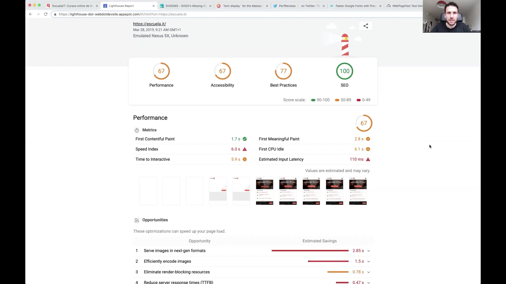

Los principales problemas tienen que ver con Speed Index y Time to Interactive. El Speed Index se puede mejorar en este caso optimizando las pocas imágenes JPG y evitando un relayout producido al cargar Javascript adicional que obliga al navegador a repintar.

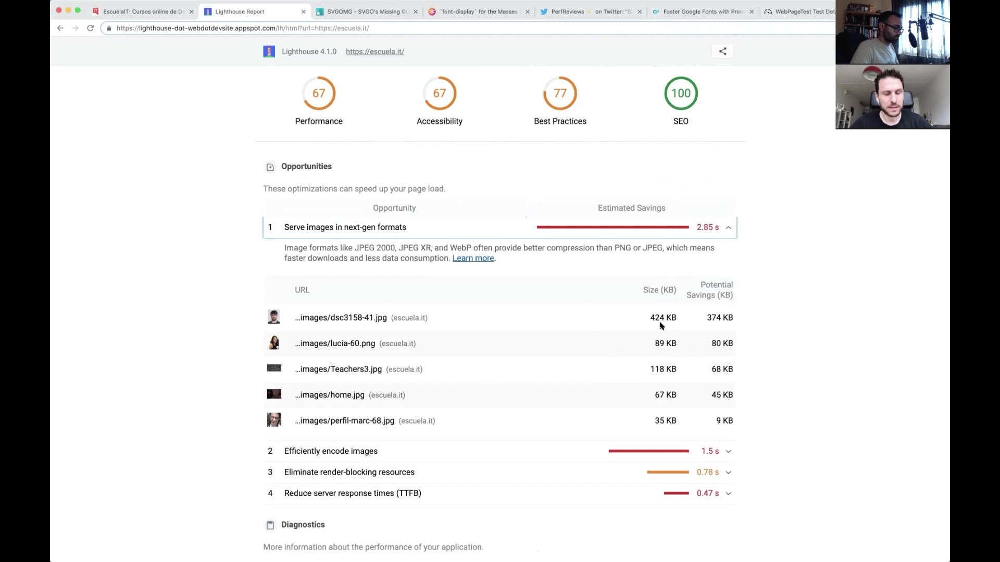

### Problemas de reflow

El problema de reflow lo podemos reproducir bloqueando la petición al recurso que añade el código Javascript que oculta el menú tras un menú "de hamburguesa".

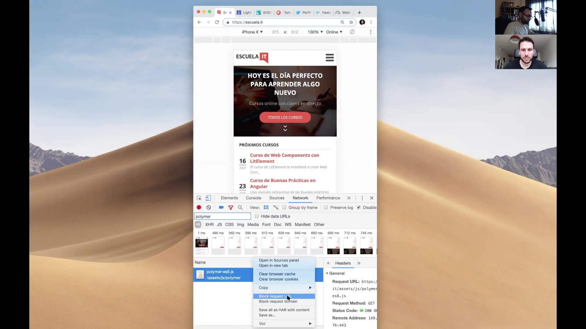

Al bloquear la petición y recargar, el menú deja de ocultarse detrás del botón superior derecha.

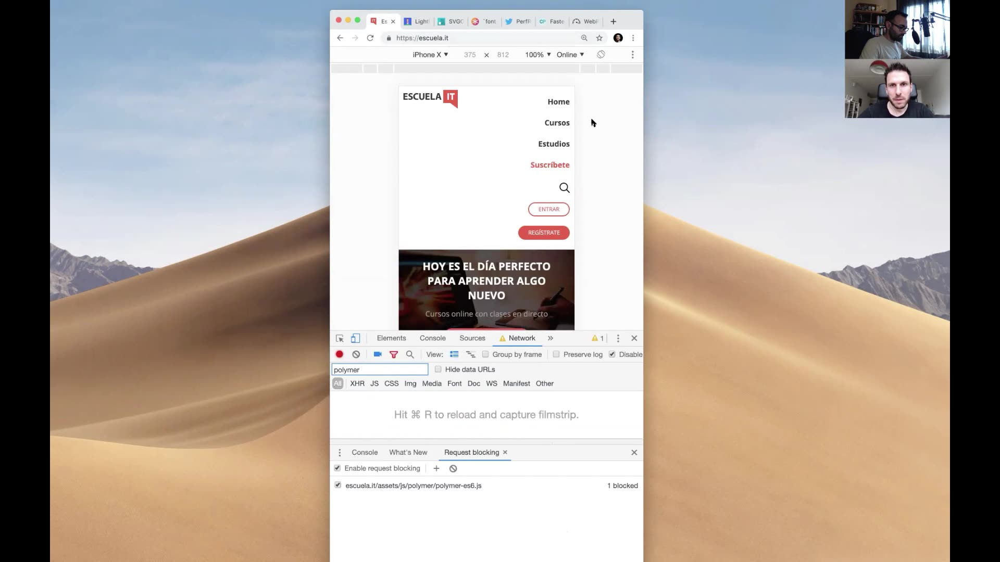

Mostrar el menú desplegado y luego usar Javascript para colapsarlo se puede justificar en ocasiones como una medida para hacer el contenido más accesible. Así, aquellas sesiones donde Javascript no esté soportado, haya sido bloqueado o simplemente la petición no se haya hecho con éxito, mostrarán el menú desplegado y completamente funcional. En este caso, sin embargo, parece más un problema introducido al añadir el script y no una decisión para hacerlo accesible.

### Informe de CSS Stats

El CSS de Escuela IT está bien aunque podría reducirse el número de reglas, media queries y fuentes. En general no hemos encontrado problemas de rendimiento en esta área.

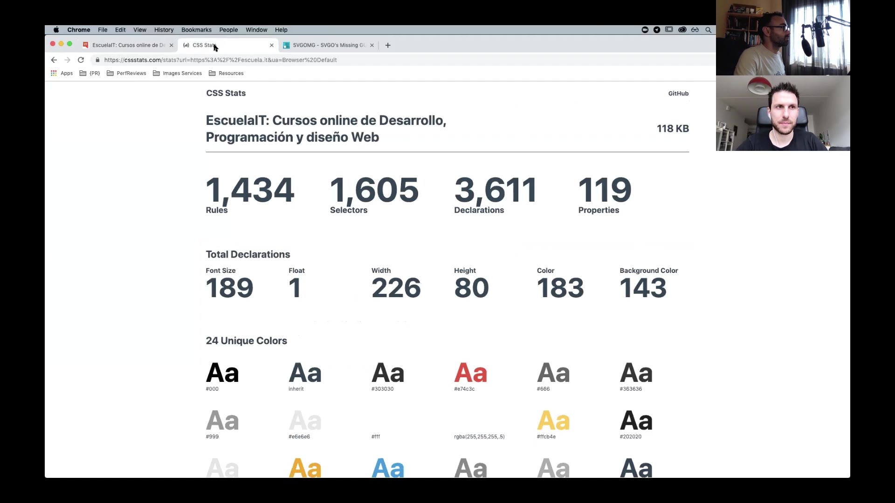

### Optimización de estáticos

La web de Escuela IT usa SVGs para la mayoría de imágenes e incluso para crear un mapa que luego es animado con Javascript. Este formato es ideal para ilustraciones e imágenes sencillas, por lo que celebramos la decisión de usarlo aquí.

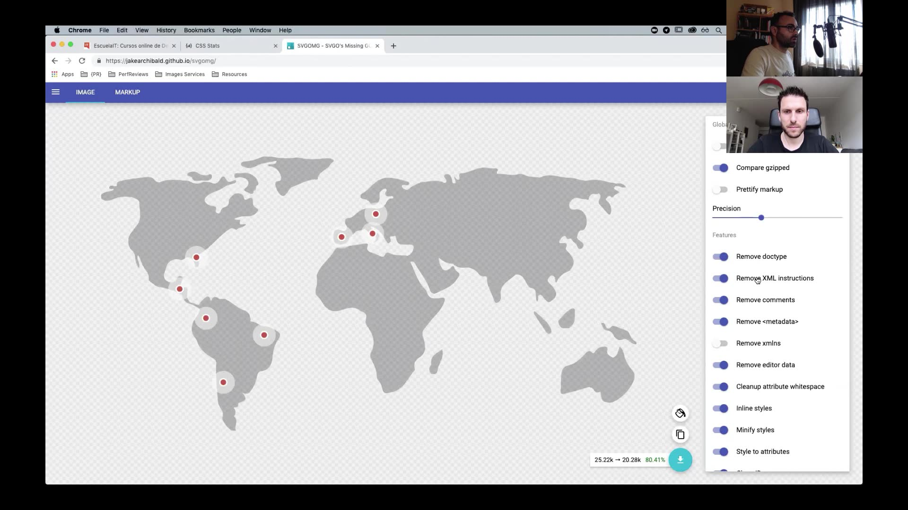

El HTML inicial no está minificado. La ganancia de performance no suele ser muy grande al eliminar esos espacios superfluos pero en el caso de Escuela IT es más importante porque incluye varios SVGs inline que no están optimizados. Uno de ellos es dicho mapa, donde tanto el SVG para el mapa (que podría ahorrar un 20% del tamaño comprimido al optimizarlo con [SVG OMG](https://jakearchibald.github.io/svgomg/)) como el Javascript para la animación están sin minificar.

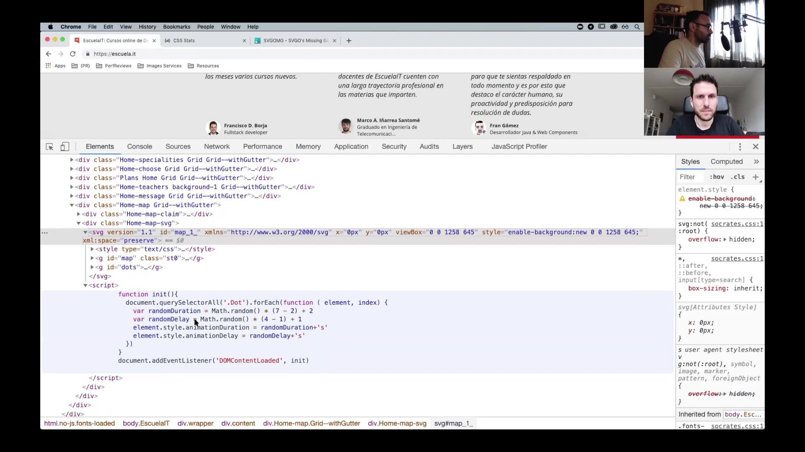

Los recursos SVG externos, que no se incluyen _inline_, tampoco están minificados e incluyen información sobre la aplicación con la que se generaron y markup innecesario como grupos `<g>` vacíos.

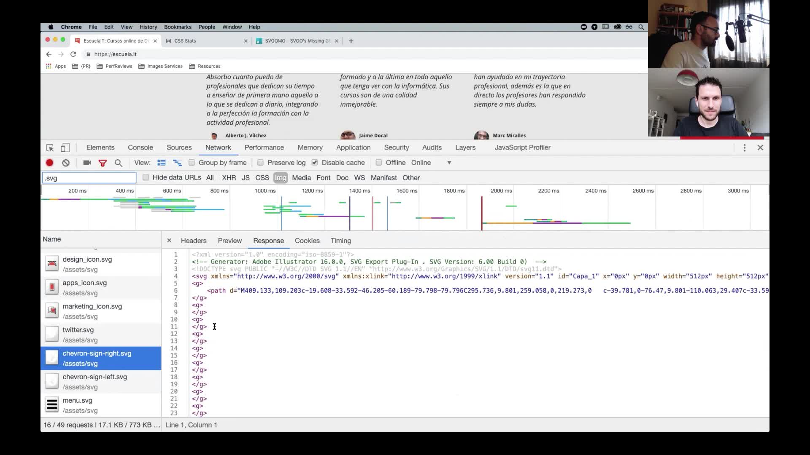

De nuevo, SVG OMG nos ayudará a eliminar ese contenido sobrante.

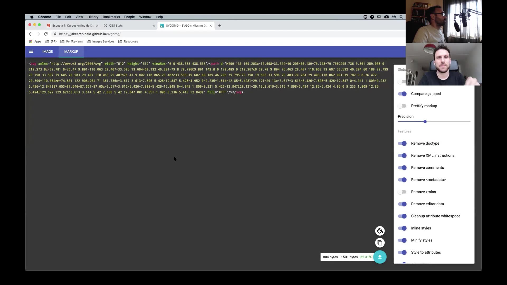

Los estáticos se sirven utilizando http/1.1, que no es la mejor opción cuando se están haciendo muchas peticiones a estáticos como en esta web. http/2 es mucho más adecuado y, aunque puede no ser trivial implementarlo en el servidor que genera el contenido dinámico, sí es sencillo sacar provecho de él moviendo el contenido estático a un CDN. Escuela IT no está usando CDNs, lo que resulta en una mayor latencia para aquellos que están lejos del servidor principal. Pensamos que un CDN mejoraría el tiempo de carga sustancialmente.

Hay al menos 3 recursos Javascript que están sin minificar. Uno de ellos, `custom.js`, utiliza jQuery para añadir funcionalidad que puede reemplazarse por llamadas estándar a las APIs del navegador. Esto evitaría incluir jQuery y hacer que el TTI baje considerablemente.

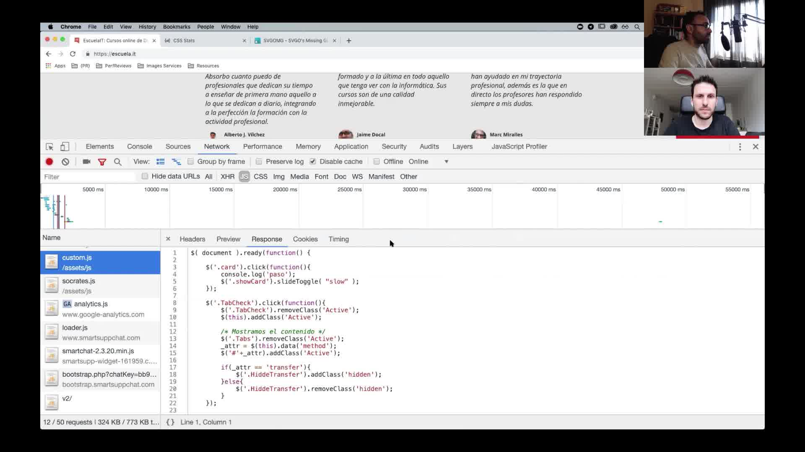

Además de algunos problemas de minificación hemos observado un tiempo de caché demasiado corto. Volviendo al informe de Lighthouse encontramos una advertencia sobre 32 recursos que tienen una TTL de caché demasiado corta.

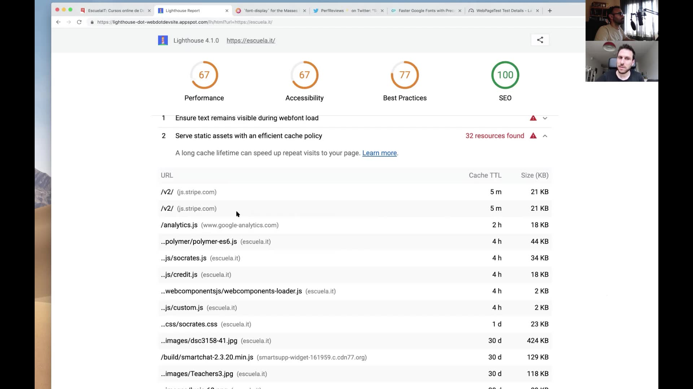

Una forma de resolverlo es versionar los estáticos utilizando un hash basado en su contenido. Así, cuando se haga un cambio en el código de ese estático, se generará uno con un nuevo nombre de fichero. Esto hará que el navegador no use la versión cacheada y solicite la nueva al servidor. Este setup permite establecer tiempos de caché mucho más largos.

Además de mejorar el rendimiento en visitas sucesivas, el versionado de los estáticos evita problemas con releases en las que el navegador utiliza recursos antiguos, retrasando la resolución de bugs e introduciendo potenciales inconsistencias.

### Carga de fuentes

Es importante evitar situaciones como la siguiente en las que no se muestra texto al usuario:


¿Qué hace el botón de llamada a la acción (CTA) naranja? Cuando dependemos de web fonts en nuestras webs hacemos que el usuario tenga que esperar para poder leer el texto porque, simplemente, no se muestra. Por ello es importante ofrecer una fuente de sistema como _fallback_ o tener clara la estrategia. Esto es un problema muy habitual en las webs.

En Escuela IT parece que se estaba siguiendo una [técnica de carga similar a la descrita en CSS Tricks](https://css-tricks.com/font-display-masses/#article-header-id-3), donde se añade una clase CSS en el `<html>` cuando la webfont se ha cargado. Sin embargo, la clase `fonts-loaded` viene incluida en el markup inicial, lo que hace invalida el proceso de carga progresivo de la fuente.

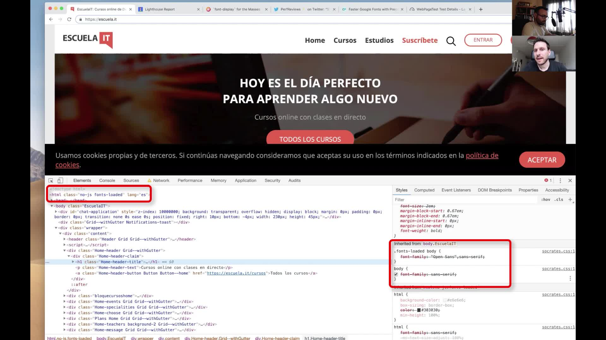

Nosotros recomendamos utilizar `font-display: swap`, que soluciona el problema sin usar Javascript y está ampliamente soportado.

Otro problema que ocurre cuando algunos assets tardan en cargar es texto con poca legibilidad. Ocurre a menudo cuando ponemos texto encima de una imagen. El texto debería ser legible cuando la imagen está cargada pero ¿qué pasa si aún no se ha cargado? En Escuela IT hay una imagen _hero_ que si no se carga hace difícil la lectura del texto principal. Esto es porque no hay un color de fondo adecuado que se utilice mientras la imagen se está solicitando.

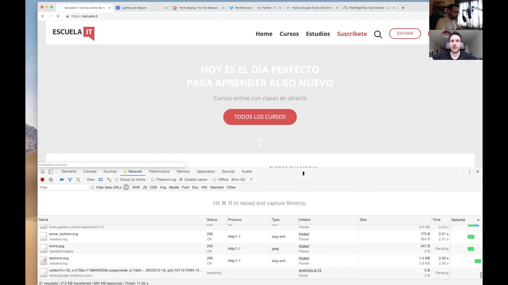

La solución es sencilla: utilizar un color de fondo que proporcione suficiente contraste. Idealmente el color debería extraerse de la imagen que queremos cargar para que no haya un cambio brusco.

Escuela IT usa fuentes de Google y se puede [acelerar su carga utilizando `preconnect`](https://twitter.com/PerfReviews_/status/1095766791220015105):

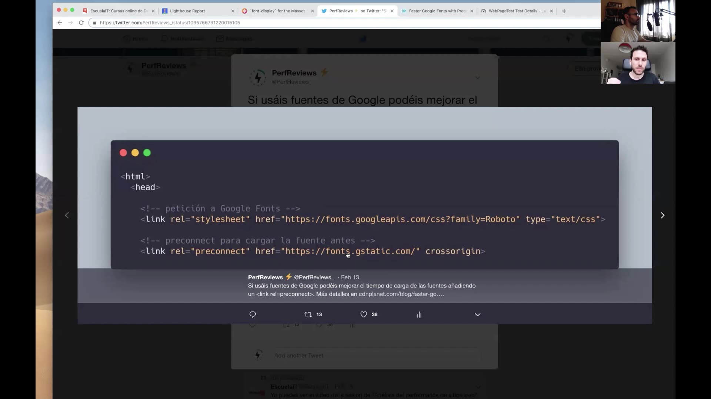

Usando el código:

```html
<link rel="preconnect" href="https://fonts.gstatic.com/" crossorigin>
```

iniciamos una conexión a `fonts.gstatic.com` antes de que el navegador sepa que necesita hacer una petición a ese dominio. Esta misma técnica se puede utilizar para mejorar la carga de recursos de terceros. En el caso de Escuela IT algunos ejemplos serían Google Analytics, Stripe o Digicert, como podemos ver por las barras de DNS, Connect y SSL en WebPageTest:

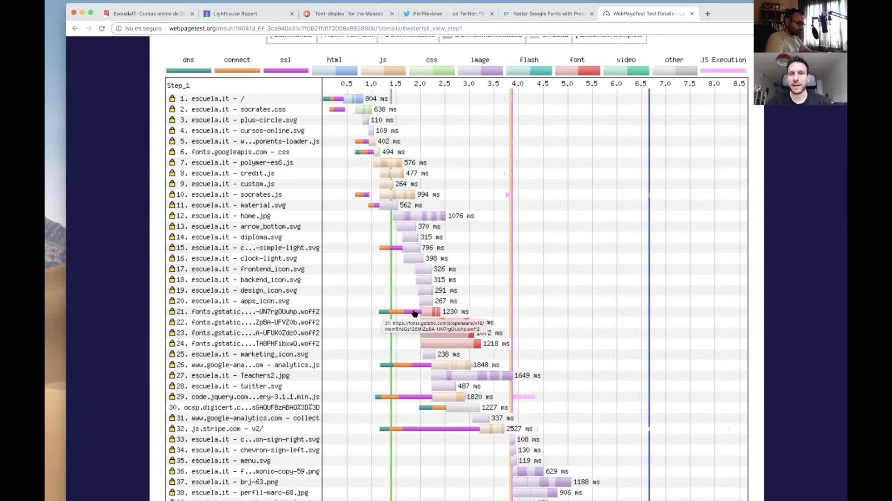

Esas barras se pueden "desacoplar" y moverlas a la izquierda para que la conexión ya se haya establecido cuando el navegador vaya a hacer la petición.

### Conclusión

Desde un punto de vista de la web performance no hemos encontrado grandes problemas. Hemos querido centrarnos en múltiples mejoras que se pueden aplicar a esta y otras webs para servir estáticos de forma eficiente.

---

## Informes

- [Lighthouse](https://lighthouse-dot-webdotdevsite.appspot.com/lh/html?url=https://escuela.it/)
- [WebPageTest desktop](http://webpagetest.org/result/190413_6F_3ca940a31e7f0821fdf72008a985680b/)
- [CSS Stats](https://cssstats.com/stats?url=https%3A%2F%2Fescuela.it&ua=Browser%20Default)

## Recurso

- [La mejor forma de cargar Google Analytics en tu web para performance](https://midu.dev/cargar-google-analytics-de-forma-optima) por [Miguel Ángel Durán](https://twitter.com/midudev).
