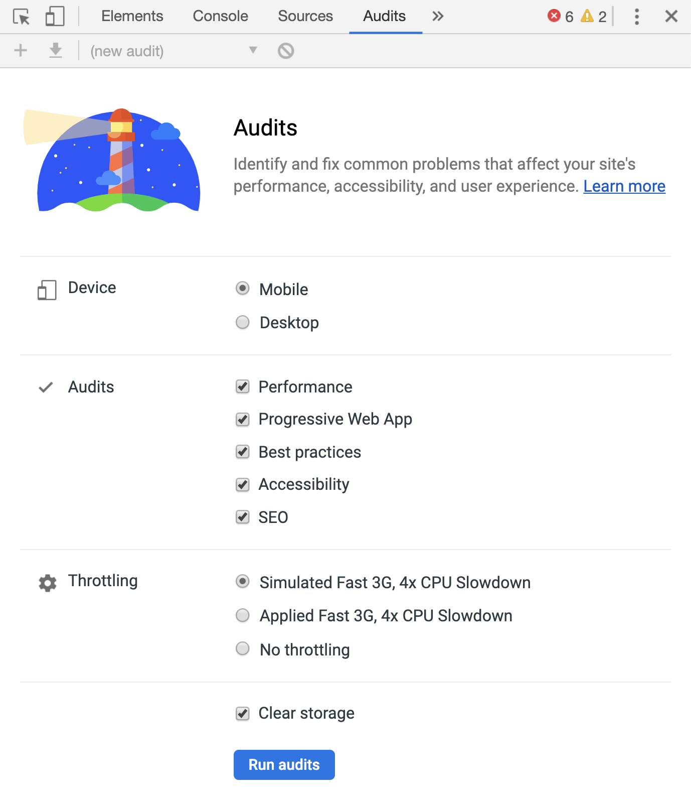
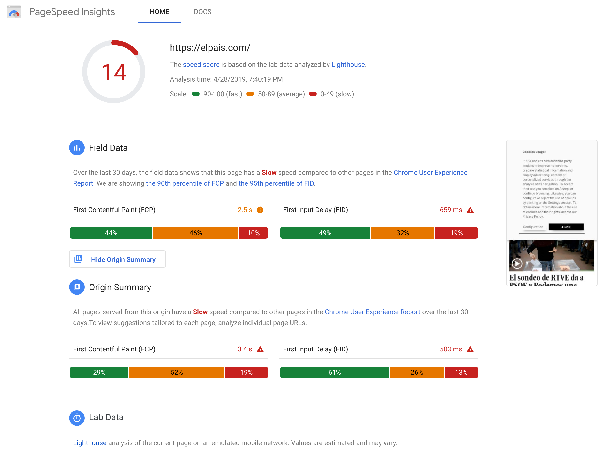
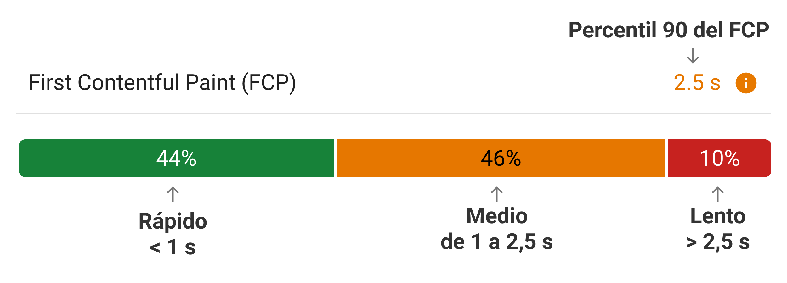
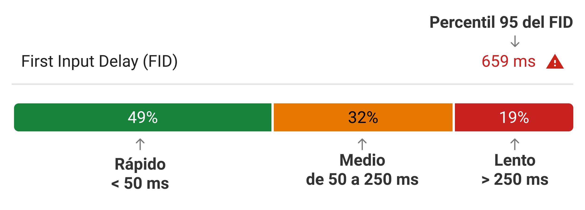

Lighthouse es una herramienta que sirve para evaluar diferentes aspectos de un sitio web, como performance o accesibilidad, y proporciona una puntuación y feedback para cada una de esas dimensiones.

Está disponible como un [módulo npm](https://github.com/GoogleChrome/lighthouse), una [extensión de Chrome](https://chrome.google.com/webstore/detail/lighthouse/blipmdconlkpinefehnmjammfjpmpbjk) y una utilidad dentro de las developer tools (panel "Audits" > "Performance").



Cuando se usa Lighthouse para establecer performance budgets, lo que nos importa es la puntuación de performance.

Cuál es una buena puntuación de performance? Un sitio web se define como rápido, medio o lento siguiendo este criterio:

* <span style="width:20px;height:9px;display:inline-block;background:#18b663"></span> Rápido: 90 a 100
* <span style="width:20px;height:9px;display:inline-block;background:#e67700"></span> Medio: 50 a 89
* <span style="width:20px;height:9px;display:inline-block;background:#c7221f"></span> Lento: 0 a 49

Las puntuación de un sitio web no es arbitraria y se calcula comparando su performance con la de otras webs de [HTTPArchive](https://httparchive.org/) y sigue una distribución log-normal.

Es posible calcular en qué percentil se encuentra una web dada su puntuación de performance. Una puntuación mayor de 50 indica que la web está en el top 25% de las webs en lo que se refiere a performance. Una puntuación de 100 implica que está en el top 2%.

## PageSpeed Insights

PageSpeeed Insights (abreviado PSI) es una forma de obtener tanto _Lab Data_ como _Field Data_ de una web en un mismo informe. La _Lab Data_ se obtiene ejecutando Lighthouse y la _Field Data_ se consigue a partir de Chrome User Experience Report (CrUX).

Chrome User Experience Report proporciona métricas de usuario real (RUM) de una amplia variedad de sitios web. PageSpeed Insights se puede consumir por medio de su API. Esta API no requiere de autenticación ni de una _api key_ para usarla. Basta con hacer una petición. Sólo es necesario obtener una _api key_ si se van a realizar una gran cantidad de peticiones, del orden de múltiples por segundo.

```
$ curl https://www.googleapis.com/pagespeedonline/
v5/runPagespeed?url=https://example.com
```

Por ejemplo, [este enlace](https://www.googleapis.com/pagespeedonline/v5/runPagespeed?url=https://perf.reviews) devuelve el resultado de Lighthouse para el sitio [perf.reviews](https://perf.reviews).

Esto lo hace ideal para integrarlo en procesos de build para aplicarlo a _performance budgets_, reportando la información como un chequeo en una Pull Request o como una alerta o notificación.

Como alternativa existe una forma de ejecutar PageSpeed Insights desde el navegador. Esto es útil para compartir resultados con otras personas que no necesariamente tienen el conocimiento técnico para ejecutar scripts y consumir APIs.

Basta con navegar a [https://developers.google.com/speed/pagespeed/insights/](https://developers.google.com/speed/pagespeed/insights/), indicar qué web se quiere analizar, y dejar que el navegador ejecute PageSpeed Insights y genere el informe.

La versión API de PageSpeed Insights devuelve la información en formato JSON, mientras quee la versión de navegador devuelve una página con los resultados organizados de una forma más visual, y se asemeja a esta imagen:



<div style="font-size: 0.9em; color: #0c5460;background-color: #ebf5f7;border: 1px solid #bee5eb;padding: .75rem 1.25rem;margin-bottom:calc(1.75rem - 1px);">
Nota: También es posible generar informes de Lighthouse en <a href="https://web.dev/measure">web.dev</a> pero no incluyen información de <i>Field Data</i> y <i>Origin Summary</i>.
</div>

El informe de PageSpeed Insights tiene 3 partes principales: _Field Data_, _Origin Summary_ y _Lab Data_.

### Field Data
Field Data proporciona información sobre la performance observada de un site durante los últimos 30 días. En particular muestra 2 métricas:

- **First Contentful Paint (FCP)**: La gráfica muestra el porcentaje de usuarios que tuvieron una experiencia rápida, media y lenta. El valor en segundos que se muestra es el percentil 90 del FCP.



- **First Input Delay (FID)**: Mide el tiempo desde que el usuario interactúa con el sitio web por primera vez hasta el momento en el que el navegador es capaz de responder a esa interacción. La gráfica es similar a la de FCP, siendo la principal diferencia es que el valor mostrado del FID es el percentil 95.



### Origin Summary
La siguiente sección de PageSpeed Insights es _Origin Summary_. Proporciona datos agregados de rendimiento para todas las páginas del origen del sitio web. Es muy práctico porque normalmente nos preocupa el rendimiento de todo el sitio web, pero a menudo sólo comprobamos el rendimiento de la página principal o la principal y alguna otra más.

### Lab Data
Estos datos son los mismos que proporciona el informe de Lighthouse.

## Más información

Para leer más sobre PageSpeed Insights y conocer más detalles del cálculo de puntuaciones, consulta estas referencias:

- [About PageSpeed Insights on developers.google.com](https://developers.google.com/speed/docs/insights/v5/about)
- [The Science Behind Google PageSpeed Insights: How It Works & What It Actually Measures](https://wpsmackdown.com/google-pagespeed-insights-explained/)
